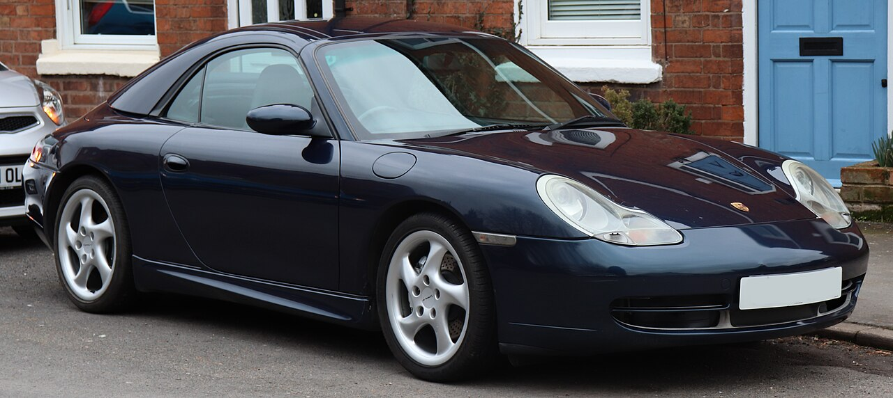
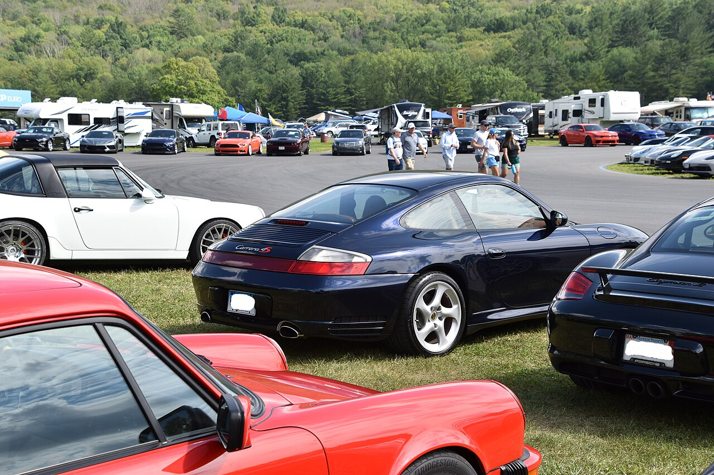
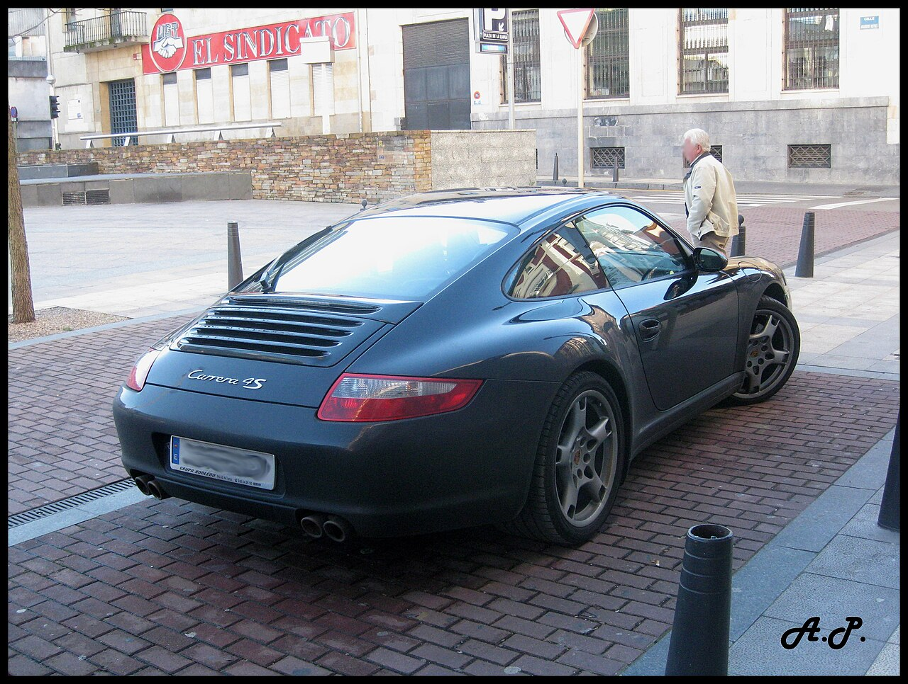
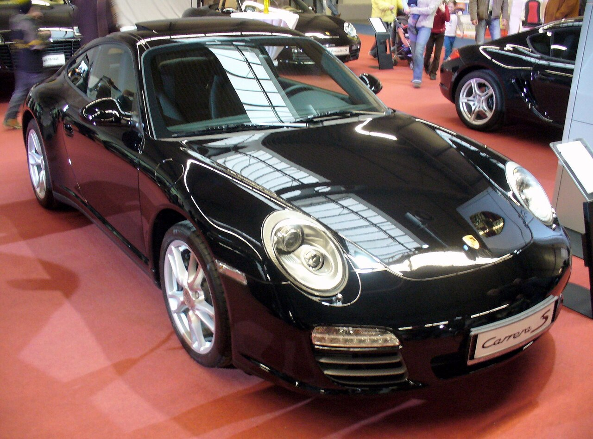
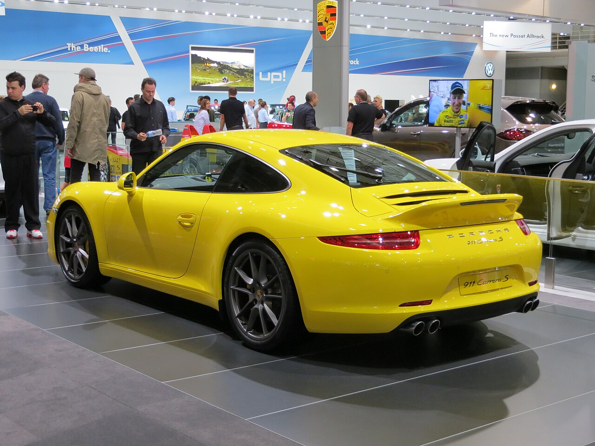
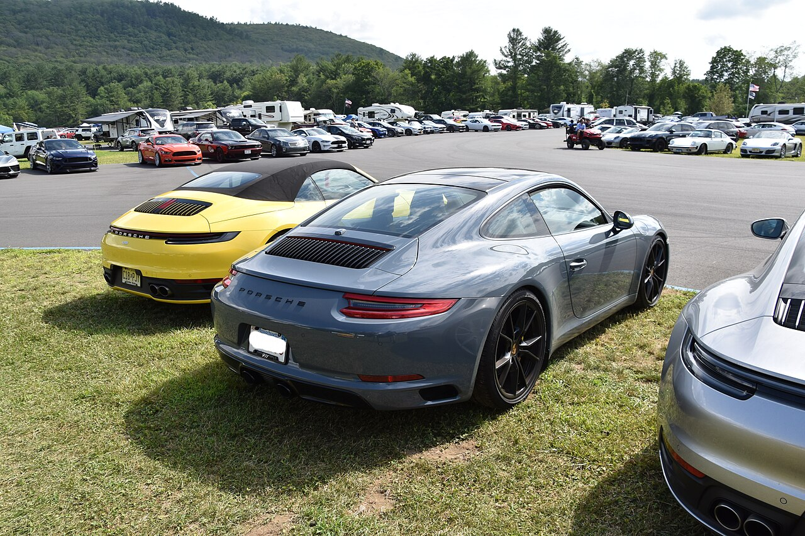

# Porsche 911 996–997–991 — универсальная шпаргалка

**Версия:** 1.2
**Срез рынка РФ:** 13 сентября 2026

> **Охват:** Porsche 911 поколений **996 (1997–2005)**, **997 (2004–2012)** и **991 (2011–2019)** — прежде всего машины, реально встречающиеся на вторичном рынке РФ.
>
> **Не входит:** 992 и более новые поколения; глубокая гоночная специфика Cup/R/RSR; коллекционные оценки редчайших спецсерий.
>
> **Цель:** по одному документу понять поколение, рестайлинг, двигатель, коробку, IMS/bore-scoring-профиль, ремонтопригодность, типовые проблемы, обслуживание, жидкости, PPI и порядок цен на вторичном рынке РФ.
>
> **Важно:** конкретный код двигателя/коробки, допуск масла, заправочный объём и сервисная процедура зависят от VIN, модельного года и рынка. Перед покупкой расходников финально сверять VIN/PET/PIWIS/мануал.

---

## Оглавление

- [Какой 911 покупать — короткий ответ](#which-one)
- [Дорестайлинг и рестайлинг: шесть фаз 996/997/991](#facelifts)
- [Легенда рисков и стоимости](#legend)
- [996.1 — 1997–2001](#phase-9961)
- [996.2 — обновление 2002 модельного года, до 2005](#phase-9962)
- [997.1 — 2004–2008](#phase-9971)
- [997.2 — с рестайлинга 2008 года до 2012](#phase-9972)
- [991.1 — 2011–2015, отдельные GT-версии до 2016](#phase-9911)
- [991.2 — с конца 2015 до 2019](#phase-9912)
- [IMS, задиры и семейства моторов — самое важное](#engine-risks)
- [Ремонтопригодность двигателей](#repairability)
- [Коробки и привод](#transmissions)
- [Общие болезни кузова, охлаждения и электрики](#common)
- [Регламент обслуживания](#maintenance)
- [Масла ДВС: допуски и объёмы](#engine-oil)
- [Остальные жидкости](#fluids)
- [Топливо](#fuel)
- [PPI перед покупкой](#ppi)
- [Короткий полевой PPI](#field-ppi)
- [Шкала стоимости ремонтов](#repair-costs)
- [Короткая карта всей линейки](#quick-map)
- [Источники и подход к данным](#sources)
- [REFERENCES.md](REFERENCES.md)
- [CHANGELOG.md](CHANGELOG.md)
- [TL;DR](#tldr)

---

# Какой 911 покупать — короткий ответ

Если нужен **самый рациональный старый водяной 911**, первым кандидатом выглядит **997.2 Carrera / Carrera S**: уже **9A1/MA1 с DFI**, без старой конструкции M96/M97 с герметичным подшипником IMS, с PDK вместо Tiptronic и с заметно более спокойным профилем по классическим задирам.

Если нужен **911 подешевле и максимально аналоговый**, 996 — не плохой автомобиль сам по себе, но покупать его нужно не по цене, а по фактическому состоянию двигателя. Для Carrera M96 обязательны история IMS и грамотная эндоскопия. Хороший экземпляр лучше дешёвого в разы.

Если хочется **современного ежедневного 911**, 991.1 Carrera/S — очень удачная точка: атмосферный 9A1, хороший PDK, современный салон и ещё классическая атмосферная реакция. 991.2 быстрее и эффективнее, но Carrera уже переходит на 3.0 biturbo и добавляет турбосистему в список дорогих узлов.

Если хочется **Turbo/GT**, правило другое: шильдик уже вторичен. Важнее происхождение, аварии, трек, перегревы, over-rev, PCCB, central-lock, состояние турбин/охлаждения, история моторных работ и качество тюнинга.

### Практический рейтинг

| Задача | Версия | Почему |
|---|---|---|
| 🟢 Самый рациональный «классический» | **997.2 Carrera / S** | 9A1/DFI, PDK, нет старого IMS-профиля |
| 🟢 Современный атмосферный daily | **991.1 Carrera / S** | 350/400 л.с., 9A1, хороший баланс |
| 🟢 Дешевле войти в 911 | **996 Carrera** | самая доступная точка входа, но только после серьёзного PPI |
| 🟡 Эмоциональный sweet spot | **997.2 GTS / 991.1 GTS** | редкие, дорогие, но очень цельные версии |
| 🟡 Быстрый daily | **991.2 Carrera S / GTS** | 3.0 biturbo, высокая отдача, современность |
| 🟠 Старый Turbo | **996 Turbo / 997 Turbo** | моторная база сильная, но возраст и дорогая периферия |
| 🔴 GT/RS как «выгодная покупка» | **GT3/GT2/RS** | покупать только как отдельный проект с экспертным PPI |

---

# Дорестайлинг и рестайлинг: шесть фаз 996/997/991

У всех трёх поколений есть принципиально важное деление на раннюю и обновлённую фазу. Обозначения **996.1/996.2, 997.1/997.2 и 991.1/991.2** широко используются владельцами, профильными сервисами и рынком; при этом Porsche в заводских материалах чаще говорит **model update / model year**, а не использует `.1/.2` как официальный индекс модели.

> **Что такое MY:** `MY` = **Model Year**, то есть **модельный год**. Это не обязательно календарный год производства и не дата первой регистрации. Например, обновлённый 996 относится к **2002 модельному году**, хотя первые такие машины могли быть произведены ещё в 2001 году. Поэтому для переходных лет год в объявлении сам по себе не определяет `.1/.2`.

> **Годы ниже прежде всего описывают Carrera-family.** Turbo, GT2, GT3, RS, Targa и специальные версии запускались по собственному графику и могут выходить за формальную границу основной Carrera. Самый наглядный пример — **911 R 2016 года**, который технически относится к атмосферной ветке 991.1.

| Фаза | Период-ориентир | Carrera: главное изменение | Коробки | Что это меняет при покупке |
|---|---|---|---|---|
| **996.1** | 1997–2001 | 3.4 M96, **300 л.с.** | 6MT / Tiptronic | ранний M96, IMS/RMS/AOS, эндоскоп по состоянию |
| **996.2** | обновление для **2002 модельного года**, до 2005 | 3.6 M96.03, **320 л.с.**; обновлённая внешность, Targa/C4S | 6MT / Tiptronic | IMS остаётся; для 3.6 эндоскоп уже обязательный пункт PPI |
| **997.1** | 2004–2008 | 3.6 **325** / 3.8 **355**, M96.05/M97.01 | 6MT / Tiptronic | последний Carrera-период M96/M97: IMS-переход + bore scoring |
| **997.2** | с рестайлинга летом/осенью 2008 до 2012 | **DFI 9A1/MA1**, 345/385 л.с. | 6MT / **7PDK** | принципиально новая Carrera-архитектура без старого IMS-подшипника |
| **991.1** | 2011–2015 для Carrera; отдельные GT-производные — до 2016 | атмосферные 3.4 **350** / 3.8 **400** | 7MT / 7PDK | современный атмосферный 9A1 |
| **991.2** | с конца 2015 до 2019 | Carrera переходит на **3.0 biturbo**, 370/420/450 л.с. | 7MT / 7PDK | к PPI добавляются турбины, наддув и тепловой контур |

> **Граница по календарному году не заменяет VIN и модельный год.** В переходный период дата производства, модельный год и первая регистрация могут относиться к разным календарным годам. Финально определять фазу по VIN, конкретной версии, мотору, внешним признакам и оборудованию.

> То же правило действует не только для 996: у **Turbo/GT/RS/Targa** всех трёх поколений собственная хронология запуска. Деление `.1/.2` в этом гайде прежде всего привязано к основной Carrera-family и к её ключевому техническому обновлению.

---

# Легенда рисков и стоимости

> Цветовые оценки ниже — **практическая шкала этого справочника**, а не заводская статистика отказов Porsche и не рассчитанная вероятность поломки.

### Риск двигателя

- 🟢 — нет характерного катастрофического дефекта семейства, но возрастные поломки возможны;
- 🟡 — есть дорогие известные слабые места, требующие проверки;
- 🟠 — эндоскопия/специализированный PPI обязательны;
- 🔴 — исключительный **моторный** риск: подтверждённая тяжёлая проблема семейства/версии или критичная кампания; высокая цена и редкость сами по себе сюда не относятся.

### Условная стоимость владения

- 🟢 — относительно простой для Porsche сценарий;
- 🟡 — нормальный 911-бюджет, нужен резерв;
- 🟠 — дорогие агрегаты/шасси/редкая специфика;
- 🔴 — Turbo/GT/RS/PCCB/редкие детали и потенциально очень дорогой ремонт.

### Ремонтопригодность двигателя

- 🟢 — агрегат хорошо изучен, запчасти и компетенции широко доступны;
- 🟡 — полноценный ремонт технически отработан, но дорог и требует профильного сервиса;
- 🟠 — специализированный ремонт, дорогие/редкие узлы или ограниченный круг компетентных мотористов;
- 🔴 — крайне тяжёлый или экономически сомнительный сценарий ремонта.

`Ремонтопригодность` — это **не** надёжность и **не** финансовый риск `💸`. Мотор может иметь высокий риск поломки, но хорошо ремонтироваться; и наоборот, редкий надёжный GT-мотор может требовать очень узкой экспертизы при капитальном ремонте.

---

# 996.1 — 1997–2001

Первая фаза водяного 911. Для обычной Carrera это **3.4 M96, 300 л.с.**, 6MT или Tiptronic. Именно здесь начинается привычная для ранних водяных Carrera тема **IMS / RMS / AOS / возрастной системы охлаждения**, но 3.4 обычно считают менее проблемным по классическому bore scoring, чем последующие 3.6/3.8.

## Основные версии 996.1

| Версия | Двигатель | Код / семейство | Мощность | Привод | Коробка | Задиры / цилиндры | Моторный риск | Рем. | 💸 |
|---|---|---|---:|---|---|---|---|---|---|
| Carrera / Carrera 4 | 3.4 NA | **M96.01 / M96.02 / M96.04 family** | 300 л.с. | RWD/AWD | 6MT / Tiptronic | 🟡 есть; у 3.4 обычно ниже, чем у 3.6/3.8 | 🟠 IMS + M96-проблемы | 🟡 | 🟡/🟠 |
| GT3, ранний | 3.6 NA | **M96.76 family** | 360 л.с. | RWD | 6MT | 🟢 не типичный Carrera M96-профиль | 🟡 motorsport engine | 🟠 | 🔴 |
| Turbo, ранний | 3.6 TT | **M96.70 / Mezger-derived** | 420 л.с. | AWD | 6MT / Tiptronic | 🟢 не типичный Carrera M96-профиль | 🟡 другой профиль | 🟠 | 🔴 |
| GT2, ранний | 3.6 TT | **M96.70S family** | 462 л.с. | RWD | 6MT | 🟢 не типичный Carrera M96-профиль | 🟡 | 🟠 | 🔴 |

> Turbo/GT-линейка имеет собственную хронологию и не совпадает идеально с Carrera model update. Здесь она показана по ранним спецификациям, чтобы не смешивать её с поздними 996.2-версиями.

## Что важно именно для 996.1

- Carrera 3.4 — не «безопасный M96», а просто несколько более спокойная зона по цилиндрам;
- IMS-конструкция менялась по ходу выпуска, поэтому тип подшипника нельзя определять только по году первой регистрации;
- RMS — отдельная течь, не равная IMS;
- AOS, помпа, расширительный бачок, радиаторы, катушки и возрастной пластик уже критичны;
- Turbo/GT используют другую, motorsport-derived архитектуру и не имеют типичного Carrera-style IMS failure mode.

## PPI 996.1

- холодный старт;
- PIWIS/Durametric и over-rev для механики;
- история IMS, если есть документированный retrofit;
- масляный фильтр на металл/пластик;
- эндоскоп цилиндров при любом расходе масла/тике/дыме, а на дорогой машине — просто как часть нормального PPI;
- AOS и вакуум;
- помпа, радиаторы, расширительный бачок;
- катушки/свечи;
- подвеска, дренажи, крыша Cabriolet, следы старых ДТП.

## Рынок РФ: 996.1 — сентябрь 2026

Выборка очень маленькая, поэтому диапазоны — только ориентир предложения.

| Сегмент | Рабочий ориентир | Комментарий |
|---|---:|---|
| Carrera/C4 с вопросами | **≈2.5–3.3 млн ₽** | дешёвая машина требует особенно жёсткого PPI |
| Живая Carrera/C4 | **≈3.3–4.2 млн ₽** | состояние двигателя важнее года |
| Turbo / ранний GT | **индивидуальная оценка** | слишком редкие машины для честной медианы |

### Практический вердикт 996.1

> **Самая доступная и аналоговая точка входа в эту серию.** Брать можно, но только машину, у которой состояние мотора доказано диагностикой, а не словами продавца.

---

# 996.2 — обновление 2002 модельного года, до 2005

Обновление, подготовленное для **2002 модельного года**, — полноценная отдельная фаза. Carrera получает **3.6 M96.03, 320 л.с.**, обновлённую внешность; появляются Targa и Carrera 4S, позднее — юбилейная 40 Jahre, Turbo S и более мощные GT-версии. Porsche прямо указывает рост объёма с 3.4 до 3.6 и мощности с 300 до 320 л.с. после обновления.

## Основные версии 996.2

| Версия | Двигатель | Код / семейство | Мощность | Привод | Коробка | Задиры / цилиндры | Моторный риск | Рем. | 💸 |
|---|---|---|---:|---|---|---|---|---|---|
| Carrera / Carrera 4 | 3.6 NA | **M96.03** | 320 л.с. | RWD/AWD | 6MT / Tiptronic | 🟠 реальный риск; эндоскоп | 🟠 IMS + цилиндры | 🟡 | 🟠 |
| Carrera 4S / Targa | 3.6 NA | **M96.03** | 320 л.с. | AWD / RWD | 6MT / Tiptronic | 🟠 реальный риск; эндоскоп | 🟠 | 🟡 | 🟠 |
| 40 Jahre | 3.6 NA | **M96.03S / X51 family** | 345 л.с. | RWD | 6MT | 🟠 реальный риск; эндоскоп | 🟠 | 🟡 | 🟠 |
| Turbo / X50 / Turbo S | 3.6 TT | **M96.70 family** | 420–450 л.с. | AWD | 6MT / Tiptronic | 🟢 не типичный Carrera M96-профиль | 🟡 отдельный профиль | 🟠 | 🔴 |
| GT3 / GT3 RS | 3.6 NA | **M96.79 / GT3 family** | 381 л.с. | RWD | 6MT | 🟢 не типичный Carrera M96-профиль | 🟡 motorsport engine | 🟠 | 🔴 |
| GT2, поздний | 3.6 TT | **M96.70S family** | до 483 л.с. | RWD | 6MT | 🟢 не типичный Carrera M96-профиль | 🟡 | 🟠 | 🔴 |

## Что изменилось относительно 996.1

| Критерий | 996.1 | 996.2 |
|---|---|---|
| Carrera | 3.4, 300 л.с. | **3.6, 320 л.с.** |
| Основной Carrera-код | M96.01/M96.04 family | **M96.03** |
| Внешность | ранняя передняя часть | обновлённая передняя часть |
| Targa / Carrera 4S | нет в ранней линейке | **появляются после model update** |
| IMS | да | да, конструкция менялась по ходу выпуска |
| Bore scoring | проверять | **для 3.6 эндоскоп особенно важен** |
| Автомат | Tiptronic | Tiptronic |

## PPI 996.2

Здесь эндоскоп для обычной Carrera уже нельзя считать факультативным:

- смотреть **все цилиндры**;
- фильтр на металл;
- история расхода масла;
- холодный и полностью прогретый мотор;
- IMS — понимать фактическую конструкцию/историю, а не верить фразе «IMS сделан»;
- RMS/AOS/помпа/бачок/радиаторы;
- для C4S/Turbo — внимательнее к полному приводу, тормозам и широкому кузову после ДТП;
- для Turbo/GT — турбины, охлаждение, over-rev, трек, PCCB и тюнинг.

## Рынок РФ: 996.2 — сентябрь 2026

| Сегмент | Рабочий ориентир | Комментарий |
|---|---:|---|
| Carrera/C4 | **≈3.3–4.2 млн ₽** | разброс состояния огромный |
| C4S / хорошие MT | **≈4.0–6.0 млн ₽** | история и кузов важнее пробега на приборке |
| Turbo | **≈5.5 млн ₽ и сильно выше** | маленькая выборка |
| GT3/GT2/RS | **индивидуальная оценка** | уже коллекционный рынок |

### Практический вердикт 996.2

> **Интереснее и зрелее 996.1, но моторный PPI для Carrera жёстче.** Хороший 3.6 ценнее «дешёвого рестайла» с неизвестными цилиндрами.

---

# 997.1 — 2004–2008

Внешне 997 возвращает классические круглые фары, но покупателю важнее другое: **Carrera всё ещё остаётся на M96/M97**. Базовая 3.6 — 325 л.с., Carrera S 3.8 — 355 л.с.; автомат — ещё Tiptronic.

## Основные версии 997.1

| Версия | Двигатель | Код / семейство | Мощность | Привод | Коробка | Задиры / цилиндры | Моторный риск | Рем. | 💸 |
|---|---|---|---:|---|---|---|---|---|---|
| Carrera / C4 / Targa 4 | 3.6 NA | **M96.05** | 325 л.с. | RWD/AWD | 6MT / Tiptronic | 🟠 реальный риск; эндоскоп | 🟠 bore scoring + переходный IMS | 🟡 | 🟠 |
| Carrera S / 4S / Targa 4S | 3.8 NA | **M97.01** | 355 л.с. | RWD/AWD | 6MT / Tiptronic | 🟠 один из главных рисков | 🟠 **эндоскоп обязателен** | 🟡 | 🟠 |
| S X51 | 3.8 NA | **M97.01S family** | 381 л.с. | RWD/AWD | 6MT / Tiptronic | 🟠 один из главных рисков | 🟠 | 🟡 | 🔴 |
| Turbo | 3.6 TT | **M97.70 / Mezger-derived** | 480 л.с. | AWD | 6MT / Tiptronic | 🟢 не типичный Carrera M96/M97-профиль | 🟡 отдельный профиль | 🟠 | 🔴 |
| GT3 / RS | 3.6 NA | **M97.76 family** | 415 л.с. | RWD | 6MT | 🟢 не типичный Carrera M96/M97-профиль | 🟡 | 🟠 | 🔴 |
| GT2 | 3.6 TT | **M97.70S family** | 530 л.с. | RWD | 6MT | 🟢 не типичный Carrera M96/M97-профиль | 🟡 | 🟠 | 🔴 |

## Что важно именно для 997.1

### Carrera 3.6 M96.05

IMS уже эволюционировал, но спорить только о подшипнике бессмысленно: мотор проверяется целиком. Нужны холодный старт, эндоскоп всех цилиндров, фильтр, oil consumption, AOS, охлаждение и история фаз.

### Carrera S 3.8 M97.01

**Один из ключевых кандидатов на bore scoring во всей серии.** Возможные признаки — тик на горячую, расход масла, более тёмный выхлоп с одной стороны, пропуски и вертикальные риски на эндоскопе. Отсутствие дыма ничего не гарантирует.

### Turbo/GT

Mezger-derived моторы имеют другой профиль риска. Для Turbo особенно важны возрастные фитинги/патрубки охлаждения, турбины, тюнинг и тепловая история. Для GT — трек, over-rev, масляная система, PCCB и происхождение.

## PPI 997.1

- **эндоскоп всех цилиндров для Carrera/S**;
- PIWIS/Durametric + over-rev;
- масло/фильтр;
- горячий тик и расход масла;
- AOS;
- помпа/термостат;
- катализаторы/выхлоп;
- Tiptronic или механика;
- PASM, рычаги, ступичные;
- радиаторы/конденсоры;
- Cabriolet/Targa механизмы и дренажи.

## Рынок РФ: 997.1 — сентябрь 2026

| Сегмент | Рабочий ориентир | Комментарий |
|---|---:|---|
| Carrera/S с большим пробегом | **≈4.2–5.0 млн ₽** | эндоскоп важнее цены |
| Хороший Carrera/S/4S | **≈5.0–6.5 млн ₽** | чистые машины могут быть выше |
| Turbo | **примерно от 7–8.5 млн ₽ и выше** | огромный разброс по истории |
| GT3/GT2/RS | **индивидуальная оценка** | слишком редкий рынок |

### Практический вердикт 997.1

> **Очень красивый и аналоговый 911, но Carrera/S нельзя покупать без эндоскопа.** Особенно осторожно — 3.8 M97.

---

# 997.2 — рестайлинг с 2008 года, до 2012

Это уже не просто косметический рестайлинг. Porsche в 2008 году переводит Carrera на **DFI 9A1/MA1**, а Tiptronic уступает место **7PDK**. Carrera получает 345 л.с., Carrera S — 385 л.с. Это одна из самых принципиальных технических границ всего справочника.

## Основные версии 997.2

| Версия | Двигатель | Код / семейство | Мощность | Привод | Коробка | Задиры / цилиндры | Моторный риск | Рем. | 💸 |
|---|---|---|---:|---|---|---|---|---|---|
| Carrera / C4 / Targa 4 | 3.6 DFI | **MA1.02 / 9A1** | 345 л.с. | RWD/AWD | 6MT / 7PDK | 🟡 возможен, но заметно ниже M96/M97-профиля | 🟢/🟡 | 🟡 | 🟡/🟠 |
| Carrera S / 4S / Targa 4S | 3.8 DFI | **MA1.01 / 9A1** | 385 л.с. | RWD/AWD | 6MT / 7PDK | 🟡 возможен, но заметно ниже M96/M97-профиля | 🟢/🟡 | 🟡 | 🟠 |
| GTS | 3.8 DFI | **MA1.01S family** | 408 л.с. | RWD/AWD | 6MT / 7PDK | 🟡 возможен, но не главный риск семейства | 🟢/🟡 | 🟡 | 🔴 |
| Turbo | 3.8 DFI TT | **MA1.70** | 500 л.с. | AWD | 6MT / 7PDK | 🟡 возможен; не главный signature risk | 🟡 | 🟠 | 🔴 |
| Turbo S | 3.8 DFI TT | **MA1.70S family** | 530 л.с. | AWD | 7PDK | 🟡 возможен; не главный signature risk | 🟡 | 🟠 | 🔴 |
| GT3 / RS | 3.8 NA | **M97.77 / M97.77R** | 435 / 450 л.с. | RWD | 6MT | 🟢 не типичный Carrera M96/M97-профиль | 🟡 Mezger GT | 🟠 | 🔴 |
| GT3 RS 4.0 | 4.0 NA | **M97.74 family** | 500 л.с. | RWD | 6MT | 🟢 не типичный Carrera M96/M97-профиль | 🟡 | 🟠 | 🔴 |
| GT2 RS | 3.6 TT | **M97.70R family** | 620 л.с. | RWD | 6MT | 🟢 не типичный Carrera M96/M97-профиль | 🟡 | 🟠 | 🔴 |

## Что изменилось относительно 997.1

- DFI;
- новая архитектура Carrera 9A1/MA1;
- нет старой M96/M97 схемы с проблемным герметичным IMS-подшипником;
- **PDK вместо Tiptronic**;
- 345/385 л.с. вместо 325/355;
- иной профиль риска двигателя.

## PPI 997.2

Профиль спокойнее, но «рест = можно не проверять» — плохая идея:

- DFI-форсунки и ТНВД;
- нагар;
- помпа/термостат;
- вакуум/утечки;
- масло/фильтр;
- ошибки фаз;
- перегревы;
- PDK: история масла, адаптации, поведение холодная/горячая;
- PASM/опоры/рычаги;
- радиаторы и конденсоры;
- PCCB/central-lock на соответствующих версиях.

## Рынок РФ: 997.2 — сентябрь 2026

| Сегмент | Рабочий ориентир | Комментарий |
|---|---:|---|
| Carrera/S/4S | **≈4.6–7.0 млн ₽** | выборка небольшая, состояние сильно двигает цену |
| GTS | **≈8 млн ₽+** | редкость |
| Turbo/Turbo S | **двузначный диапазон возможен** | история и комплектация критичны |
| GT/RS | **индивидуальная оценка** | коллекционный рынок |

### Практический вердикт 997.2

> **Один из самых рациональных старых 911:** классическая размерность/ощущения 997, но уже DFI + PDK и без старого Carrera IMS-профиля.

---

# 991.1 — 2011–2015 для Carrera; GT-производные до 2016

991 становится крупнее и современнее, получает электромеханический усилитель и очень развитое шасси, но Carrera ещё остаётся **атмосферной**: 3.4 на 350 л.с., 3.8 на 400 л.с., GTS — 430 л.с. Это самостоятельная эпоха и один из главных sweet spot всей серии.

## Основные версии 991.1

| Версия | Двигатель | Код / семейство | Мощность | Привод | Коробка | Задиры / цилиндры | Моторный риск | Рем. | 💸 |
|---|---|---|---:|---|---|---|---|---|---|
| Carrera / C4 / Targa 4 | 3.4 DFI NA | **MA1.04 / 9A1** | 350 л.с. | RWD/AWD | 7MT / 7PDK | 🟡 возможен; не главный риск | 🟢/🟡 | 🟡 | 🟡 |
| Carrera S / 4S / Targa 4S | 3.8 DFI NA | **MA1.03 / 9A1** | 400 л.с. | RWD/AWD | 7MT / 7PDK | 🟡 возможен; не главный риск | 🟢/🟡 | 🟡 | 🟡/🟠 |
| GTS / Carrera 4 GTS / Targa 4 GTS | 3.8 DFI NA | **9A1/MA1 GTS family** | 430 л.с. | RWD/AWD | 7MT / 7PDK | 🟡 возможен; не главный риск | 🟢/🟡 | 🟡 | 🟠 |
| Turbo | 3.8 TT | **MA1.71 family** | 520 л.с. | AWD | 7PDK | 🟡 возможен; не главный риск | 🟡 | 🟠 | 🔴 |
| Turbo S | 3.8 TT | **MA1.71 family** | 560 л.с. | AWD | 7PDK | 🟡 возможен; не главный риск | 🟡 | 🟠 | 🔴 |
| GT3 | 3.8 NA | **MA1.75 family** | 475 л.с. | RWD | 7PDK | 🟡 не M96/M97-профиль; история двигателя критична | 🟠 campaign/history critical | 🟠 | 🔴 |
| GT3 RS / 911 R | 4.0 NA | **MA1.76 family** | 500 л.с. | RWD | PDK / 6MT (R) | 🟡 не M96/M97-профиль; спец-PPI | 🟡/🟠 | 🟠 | 🔴 |

## Что важно именно для 991.1

- атмосферная реакция без старой M96/M97 архитектуры;
- PDK уже зрелый и быстрый;
- активные опоры двигателя, PASM, PDCC, rear-axle steering на соответствующих версиях увеличивают стоимость старения;
- Targa имеет сложный механизм крыши;
- **GT3 2014 модельного года (MY2014) требует отдельной проверки кампании AE01 и происхождения/истории двигателя**.

## PPI 991.1

- холодный запуск и фазовращатели;
- DFI/форсунки и топливное давление;
- помпа/термостат;
- масло/фильтр;
- коррекции/пропуски;
- PDK и история масла;
- активные опоры;
- PASM/PDCC/RAS;
- front axle lift на GT;
- PCCB/central-lock;
- Targa/Cabriolet крыша;
- геометрия и кузов после ДТП.

### 991.1 GT3: AE01

На затронутых автомобилях **2014 модельного года (MY2014)** Porsche проводил кампанию с заменой двигателя после проблем с шатунными болтами. Для такой машины нужны VIN-проверка, номер установленного двигателя и документы выполненной кампании.

## Рынок РФ: 991.1 — сентябрь 2026

| Сегмент | Рабочий ориентир | Комментарий |
|---|---:|---|
| Carrera/S/4S | **≈6.8–9.0 млн ₽** | пробег и кузов сильно влияют |
| Редкие/малый пробег | **≈9–14 млн ₽** | спецификация важнее средней цены |
| GT3 | **≈10.7 млн ₽+** | AE01/engine lineage обязательны |
| Turbo/GT/RS | **индивидуальная оценка** | маленькая выборка |

### Практический вердикт 991.1

> **Лучший вариант для того, кто хочет уже современный 911, но ещё атмосферную Carrera.** Очень сильный daily/sports-car баланс.

---

# 991.2 — с конца 2015 до 2019

Model update 2015 года принципиально меняет Carrera: базовые версии переходят на **3.0 biturbo**. Мощности — 370 л.с. у Carrera, 420 у S и 450 у GTS. Это уже другая силовая концепция, поэтому 991.2 нельзя рассматривать как просто «991 с другими фонарями».

## Основные версии 991.2

| Версия | Двигатель | Код / семейство | Мощность | Привод | Коробка | Задиры / цилиндры | Моторный риск | Рем. | 💸 |
|---|---|---|---:|---|---|---|---|---|---|
| Carrera / C4 / Targa 4 / T | 3.0 TT | **MDC.KA** | 370 л.с. | RWD/AWD | 7MT / 7PDK | 🟡 не классический M96/M97-профиль | 🟡 | 🟡/🟠 | 🟡/🟠 |
| Carrera S / 4S / Targa 4S | 3.0 TT | **MDC.HA** | 420 л.с. | RWD/AWD | 7MT / 7PDK | 🟡 не классический M96/M97-профиль | 🟡 | 🟡/🟠 | 🟠 |
| GTS / Carrera 4 GTS / Targa 4 GTS | 3.0 TT | **MDC.JA** | 450 л.с. | RWD/AWD | 7MT / 7PDK | 🟡 не классический M96/M97-профиль | 🟡 | 🟡/🟠 | 🟠/🔴 |
| Turbo | 3.8 TT | **MDA.BA family** | 540 л.с. | AWD | 7PDK | 🟡 не классический M96/M97-профиль | 🟡 | 🟠 | 🔴 |
| Turbo S | 3.8 TT | **MDB.CA family** | 580 л.с. | AWD | 7PDK | 🟡 не классический M96/M97-профиль | 🟡 | 🟠 | 🔴 |
| GT3 | 4.0 NA | **GT 4.0 / MDG family** | 500 л.с. | RWD | 6MT / 7PDK | 🟡 не классический M96/M97-профиль | 🟡 | 🟠 | 🔴 |
| GT3 RS | 4.0 NA | **GT 4.0 family** | 520 л.с. | RWD | 7PDK | 🟡 не классический M96/M97-профиль | 🟡 | 🟠 | 🔴 |
| GT2 RS | 3.8 TT | **MDH.NA family** | 700 л.с. | RWD | 7PDK | 🟡 не классический M96/M97-профиль | 🟡/🟠 высокая форсировка; спец-PPI | 🟠 | 🔴 |
| Speedster | 4.0 NA | **GT 4.0 family** | 510 л.с. | RWD | 6MT | 🟡 не классический M96/M97-профиль | 🟡 GT-derived; спец-PPI | 🟠 | 🔴 |

## Что изменилось относительно 991.1

- Carrera: атмосферные 3.4/3.8 → **3.0 biturbo**;
- 350/400/430 → **370/420/450 л.с.**;
- гораздо больше момента снизу;
- к PPI добавляются турбины, актуаторы, charge-air tract, boost leaks и heat management;
- тюнинг становится особенно важным фактором риска.

## PPI 991.2

- турбины и актуаторы;
- charge-air тракт и утечки;
- wastegate;
- фактический boost requested/actual;
- система охлаждения и тепловая история;
- вакуум;
- масло/фильтр;
- DFI и топливное давление;
- PDK холодная/горячая;
- кто и как прошивал машину, если есть тюнинг;
- PASM/PDCC/RAS/dynamic mounts;
- central-lock/PCCB/front lift на дорогих версиях;
- кузов и геометрия.

## Рынок РФ: 991.2 — сентябрь 2026

| Сегмент | Рабочий ориентир | Комментарий |
|---|---:|---|
| Carrera/S/4S | **≈8.8–12.5 млн ₽** | основная современная зона |
| Turbo/Turbo S | **≈14–15 млн ₽+** | маленькая выборка |
| GT2 RS | **≈25 млн ₽+** | уже коллекционный рынок |
| GT3/RS/Speedster | **индивидуальная оценка** | история и происхождение решают всё |

### Практический вердикт 991.2

> **Самая современная и быстрая Carrera в рамках этого гайда.** Для daily великолепна, но турбосистема и сложное шасси означают более дорогой PPI и больший резерв на возрастные узлы.

---

# IMS, задиры и семейства моторов — самое важное

Эта таблица — главная причина существования справочника.

| Семейство | Где | IMS старого типа | Классический bore-scoring профиль | Что делать перед покупкой |
|---|---|---|---|---|
| **M96 Carrera** | 996 Carrera | **Да, конструкция зависит от года** | 🟠 есть | история IMS + эндоскоп + фильтр |
| **M96.05 / M97 Carrera** | 997.1 | **переходная/увеличенная конструкция** | 🟠 особенно 3.8 | эндоскоп обязателен |
| **Mezger-derived Turbo/GT** | 996 Turbo/GT, 997.1 Turbo/GT, 997.2 GT | **нет Carrera-style failure mode** | не типичный M96 Carrera risk | специализированный Turbo/GT PPI |
| **9A1/MA1 NA** | 997.2, 991.1 Carrera | **нет старой схемы** | существенно ниже | обычный глубокий PPI, фильтр при сомнениях |
| **9A1/MA1 turbo** | 997.2 Turbo, 991 Turbo | **нет старой схемы** | не главный риск | турбины/наддув/охлаждение/PDK |
| **991.2 3.0TT** | Carrera/S/GTS | **нет** | не главный риск | турбины/heat management/boost leaks |

### Не путать три вещи

**IMS**, **RMS** и **bore scoring** — три разных проблемы.

- IMS — подшипник/узел промежуточного вала;
- RMS — задний сальник коленвала, сам по себе обычно не означает смерть двигателя;
- bore scoring — повреждение рабочей поверхности цилиндра, потенциально требующее дорогого ремонта блока.

Замена RMS не «лечит IMS». Замена IMS не «лечит задиры». Сухой мотор снаружи не гарантирует целые цилиндры.

---

# Ремонтопригодность двигателей

Здесь оценивается **возможность качественно восстановить агрегат**, а не вероятность его поломки и не цена машины. Для 911 это особенно важно: старый M96/M97 с известными проблемами может быть вполне ремонтопригодным благодаря отработанным технологиям восстановления, тогда как редкий GT/Turbo-мотор при хорошем исходном ресурсе требует гораздо более узкой экспертизы.

| Семейство | Где | Ремонтопригодность | Что это означает на практике |
|---|---|---|---|
| **M96 Carrera 3.4/3.6** | 996.1 / 996.2 | 🟡 | семейство очень хорошо изучено; существуют отработанные решения по цилиндрам, IMS и полной переборке, но правильный ремонт дорог и требует профильного моториста |
| **M96.05 / M97 Carrera** | 997.1 | 🟡 | задиры и геометрия цилиндров ремонтируются; технологии гильзовки/восстановления давно существуют, но экономить на половинчатой переборке опасно |
| **Mezger-derived Turbo/GT** | 996 Turbo/GT, 997 Turbo/GT | 🟠 | конструктивно сильная база, но капитальный ремонт — уже работа узкого Porsche/GT-профиля; детали и машинные работы дорогие |
| **9A1/MA1 атмосферный** | 997.2 / 991.1 Carrera | 🟡 | старого IMS-профиля нет; Alusil-блоки также восстанавливаются, но DFI и более современная архитектура требуют профильной компетенции |
| **9A1/MA1 turbo** | 997.2 Turbo / 991.1 Turbo | 🟠 | ремонтируемый мотор, но сам двигатель, турбины, охлаждение, топливная и навесное делают большой ремонт специализированным и дорогим |
| **991.1 GT3 / RS / R** | 991.1 GT-family | 🟠 | специализированный ремонт; для раннего GT3 критична подтверждённая история двигателя и кампании |
| **991.2 Carrera 3.0TT** | Carrera / S / GTS | 🟡/🟠 | массовее GT/Turbo и хорошо диагностируется профильными сервисами, но турбины, DFI и тепловой контур повышают сложность большого ремонта |
| **991.2 Turbo / GT / GT2 RS / Speedster** | верхняя линейка 991.2 | 🟠 | технически ремонтируемо, но нужны узкие компетенции, дорогие оригинальные/специализированные детали и точная история конкретного агрегата |

### Что важно понимать про «задиры»

**M96/M97 не являются одноразовыми моторами.** Для них существуют полноценные технологии восстановления цилиндров и известный набор доработок. Поэтому диагноз bore scoring означает дорогой ремонт, а не автоматически «двигатель в металлолом». LN Engineering описывает как полноценные M96/M97 rebuild-процедуры, так и восстановление повреждённых цилиндров; аналогичные капитальные ремонты много лет выполняют профильные Porsche-мотористы.

Для **9A1/MA1** риск классического M96/M97 scoring заметно ниже и имеет другой профиль, но считать эти моторы физически неспособными получить повреждение цилиндров тоже неправильно: специализированное восстановление Alusil-блоков существует и для MA1/9A1.

> Практический смысл оценки простой: **🟡 M96/M97 — риск может быть высоким, но технология спасения хорошо известна; 🟠 Mezger/GT/Turbo — риск конкретного дефекта часто ниже, зато сам капитальный ремонт требует более редкой экспертизы.**

---

# Коробки и привод

## 996

- 6-ступенчатая механика;
- 5-ступенчатый Tiptronic на автоматических версиях;
- RWD или AWD в зависимости от версии.

Проверять механику:

- синхронизаторы;
- особенно 2-ю передачу на проблемных экземплярах;
- сцепление;
- двухмассовый маховик;
- течи;
- тросы/кулису.

Tiptronic обычно прочный, но возраст уже огромный: масло, гидроблок, блокировка ГТ, пинки и задержки D/R важнее мифа «масло на весь срок».

## 997.1

Та же общая философия: 6MT или Tiptronic.

## 997.2

Ключевой переход — **7PDK**. Это первая серийная эпоха PDK на 911.

Проверять:

- D/R без длинной паузы;
- плавное трогание;
- отсутствие judder;
- переключения на холодную и горячую;
- kickdown;
- ручной режим;
- ошибки;
- температуры;
- adaptation values;
- историю масла/фильтра.

## 991

Основные коробки:

- 7PDK;
- 7MT на Carrera/GTS;
- 6MT на некоторых поздних GT-версиях (например 991.2 GT3, 911 R/Speedster в своей спецификации).

PDK хороша, но не бесплатна. Мехатроник, сцепления и крупный внутренний ремонт могут стоить сотни тысяч рублей.

## AWD

Полный привод не делает 911 внедорожником. Проверять:

- одинаковый размер/модель шин на оси и правильную общую комбинацию;
- близкий износ;
- отсутствие ошибок PSM/PTM;
- передний редуктор/привода;
- вибрации под тягой;
- историю жидкостей там, где они обслуживаются.

---

# Общие болезни кузова, охлаждения и электрики

## Передняя часть

У всех этих 911 радиаторы и конденсоры находятся в очень уязвимой зоне воздухозаборников.

Проверить:

- листья/грязь между пакетами;
- коррозию;
- течи ОЖ;
- утечки хладагента;
- вентиляторы;
- следы ремонта после удара;
- состояние пластиковых воздуховодов.

## Вода

- дренажи люка/кабриолета/Targa;
- мокрые ковры;
- вода под сиденьями;
- разъёмы и блоки;
- запах сырости;
- запотевание.

## Подвеска

На машине 15–25-летнего возраста даже «Porsche с маленьким пробегом» может иметь мёртвые резиновые элементы.

Проверять:

- рычаги;
- сайлентблоки;
- шаровые;
- опоры;
- ступичные;
- PASM;
- высоту кузова;
- следы дешёвых нештатных решений.

## Тормоза

Обычные стальные тормоза дороги, но предсказуемы.

**PCCB** требуют отдельной оценки:

- сколы;
- поверхность;
- перегрев;
- реальный износ;
- история замены;
- стоимость нового комплекта.

«Керамика есть» — не всегда плюс к цене, если диски на исходе.

---

# Регламент обслуживания

Ниже два слоя: **заводской принцип** и **практический интервал для возрастной машины**. Практический интервал намеренно консервативнее длинных заводских интервалов.

| Работа | Практический ориентир |
|---|---|
| Масло ДВС + фильтр | **раз в год или 7.5–10 тыс. км**; GT/трек/короткие поездки — чаще |
| Воздушные фильтры | 20–30 тыс. км, чаще в пыли |
| Салонный фильтр | ежегодно |
| Свечи | обычно 40–60 тыс. км; Turbo/GT — сверять модельный регламент, часто чаще |
| Катушки | по состоянию, менять деградирующие комплектно/осмысленно |
| Тормозная жидкость | **каждые 2 года** |
| Ремень навесного | осмотр каждое ТО; возраст важен не меньше пробега |
| ОЖ | состояние/спецификация/герметичность; неизвестную историю лучше привести к понятному состоянию |
| PDK | практично ориентироваться примерно на 60 тыс. км, но точный регламент зависит от поколения/года |
| Tiptronic | не считать «вечным»; обслуживание по состоянию/истории, часто 60–80 тыс. км |
| Механика/редукторы | 60–100 тыс. км как разумный возрастной ориентир, VIN/мануал приоритетнее |

### Для мало ездящей машины

Пять тысяч километров за пять лет — **не аргумент не менять жидкости**. Возраст влияет на тормозную жидкость, топливо, резину, ремни, уплотнения, аккумулятор и коррозию.

---

# Масла ДВС: допуски и объёмы

Для основной массы 996/997/991 до **2020 модельного года (MY2020)** ключевой исторический допуск — **Porsche A40**. Но у поздних 991, особенно с бензиновым сажевым фильтром и у части GT-моделей, могут применяться другие Porsche approvals (включая C40/C40 GT в соответствующих бюллетенях).

> **Не выбирать масло только по вязкости.** Сначала нужный Porsche approval для конкретного VIN/model year, потом конкретный продукт из действующего approval list.

Официальный список Porsche A40 02/26 прямо охватывает автомобили до **2020 модельного года (MY2020)**, для которых A40 назначен. Для конкретной поздней машины всё равно сверять allocation bulletin.

### Рабочие сервисные объёмы

| Версия | Ориентир при сервисе | Комментарий |
|---|---:|---|
| 996 Carrera 3.4 | **≈8.25 л** | с фильтром; проверять по уровню/процедуре |
| 996 Carrera 3.6 | **≈8.25 л** | с фильтром |
| 996 GT3 | **≈8.5–9.0 л** | зависит от MY |
| 997.1 Carrera 3.6 | **≈8.25 л** | M96.05 |
| 997.1 Carrera S 3.8 | **≈8.5 л** | M97.01 |
| 997.2 Carrera/S/GTS | **≈7.5 л** | 9A1/MA1 |
| 997.2 Turbo/S | **≈7.5 л** | рабочий ориентир |
| 997.2 GT3/RS | **≈9.0 л** | GT dry-sump architecture; процедура критична |
| 991.1 Carrera/S/GTS | **≈7.5 л** | 9A1 |
| 991.1 Turbo/S | **≈7.5 л** | |
| 991.2 Carrera/S/GTS 3.0TT | **≈8.0 л** | |
| 991.2 Turbo/S | **≈7.5 л** | |
| 991.2 GT3/RS | **≈6.4 л** | сверять конкретную GT-версию |
| 991.2 GT2 RS | **≈7.5 л** | |

Это **не инструкция «залить сразу столько»**. Уровень выставляется по штатной процедуре с нужной температурой/режимом, а точный объём зависит от того, насколько система была слита.

---

# Остальные жидкости

## Тормозная жидкость

**DOT 4 требуемого Porsche класса**, каждые 2 года. Для трека — жидкость с подходящими температурными характеристиками и более частая замена.

## Охлаждающая жидкость

Не выбирать по цвету.

- точная Porsche specification по поколению/VIN;
- неизвестную смесь лучше не «доливать чем-то похожим» бесконечно;
- после крупного ремонта важно правильное вакуумное заполнение/развоздушивание.

## PDK / Tiptronic / механика

Нельзя переносить жидкость между коробками по принципу «это же Porsche 911».

- PDK имеет собственную спецификацию и процедуру уровня;
- Tiptronic — другую;
- механическая коробка — свою;
- передний/задний редукторы — свои.

**VIN и индекс коробки — перед заказом масла.**

---

# Топливо

| Топливо | Вердикт |
|---|---|
| **АИ-92** | ❌ не использовать как штатное |
| **АИ-95** | 🟡 возможен как допустимый минимум на части версий, но не базовый выбор для высокофорсированного 911 |
| **АИ-98** | 🟢 основной разумный выбор для большинства 996/997/991 |
| **АИ-100** | 🟢 допустим; особенно логичен для Turbo/GT/тюнинга при соответствующей калибровке |

Если машина прошита, требуемое октановое число определяет **конкретная прошивка**, а не заводская табличка двадцатилетней давности.

---

# PPI перед покупкой

## 1. Документы и происхождение

- VIN;
- ПТС/ЭПТС;
- регистрационная история;
- ДТП;
- ограничения/залоги;
- пробеги;
- заказ-наряды;
- Porsche/PIWIS history;
- номера двигателя/коробки на редких версиях;
- заводская комплектация;
- крупные моторные работы;
- тюнинг/прошивки;
- трековая эксплуатация.

Для GT/RS/Turbo происхождение может менять цену на миллионы.

## 2. Только холодный старт

Продавец не должен заранее прогревать машину.

Слушаем:

- цепи;
- тяжёлый ритмичный тик;
- пропуски;
- гидрики/фазы;
- дым;
- турбины;
- посторонние звуки навесного.

## 3. PIWIS / Durametric

Минимум:

- DME;
- коробка;
- PSM/ABS;
- PASM;
- AWD/PTM на соответствующих версиях;
- rear axle steering/PDCC/engine mounts на 991;
- климат;
- кузовные блоки;
- PCM;
- постоянные/intermittent/stored faults.

### Over-rev

На механических машинах — особенно GT — считать over-rev ranges обязательной частью PPI. Важны **диапазон, число воспламенений и часы работы после события**, а не только факт наличия записи.

## 4. Эндоскоп

### 996 Carrera и 997.1 Carrera/S

**Обязателен.** Смотреть все цилиндры, а не один «для галочки».

Ищем:

- вертикальные задиры;
- локальную потерю поверхности;
- зеркальность;
- масло;
- повреждения юбки поршня;
- неодинаковый нагар.

По M96/M97 полезен осмотр с той стороны цилиндра, где scoring обычно начинается; профильные специалисты часто используют доступ снизу через картер для более информативного угла.

### 997.2 / 991

Не надо автоматически ставить диагноз M96/M97. Эндоскоп всё равно разумен при:

- расходе масла;
- тике;
- пропусках;
- металле в фильтре;
- подозрительном ремонте;
- дорогой покупке GT/Turbo.

## 5. Масло и фильтр

Если цена автомобиля оправдывает глубокий PPI:

- вскрыть фильтр;
- искать металл/пластик;
- при сомнениях лабораторный анализ;
- проверить давление масла/температуры по диагностике.

## 6. Коробка

Холодная и горячая:

- D/R;
- трогание;
- все передачи;
- kickdown;
- ручной режим;
- отсутствие slip/flare;
- адаптации;
- ошибки;
- история обслуживания.

Для MT — сцепление, маховик, синхронизаторы, over-rev.

## 7. Охлаждение

- передние радиаторы;
- конденсоры;
- помпа;
- термостат;
- бачок;
- крышка;
- шланги;
- вентиляторы;
- стабильность температуры;
- Turbo/GT — фитинги/магистрали и следы старых ремонтов.

## 8. Подвеска и активные системы

- PASM;
- PDCC;
- RWS;
- active engine mounts;
- front lift;
- ступичные;
- рычаги;
- геометрия;
- высота кузова.

## 9. Тормоза и колёса

- диски/колодки;
- PCCB;
- central lock;
- трещины/ремонт дисков;
- возраст шин;
- N-mark не является магией, но правильный размер/load/speed и одинаковая логичная резина критичны;
- на AWD особенно важна согласованность окружности колёс.

## 10. Кузов

- толщиномер;
- лонжероны/силовые зоны;
- крепления подвески;
- передний/задний модуль;
- днище;
- швы;
- фары;
- геометрия зазоров;
- следы трека/бордюров снизу.

---

# Короткий полевой PPI — открыть на телефоне

- [ ] VIN / история / ограничения / ДТП
- [ ] машина реально холодная
- [ ] нет тяжёлого тика/дыма/пропусков
- [ ] PIWIS/Durametric всех ключевых блоков
- [ ] MT: over-rev ranges + сцепление/маховик
- [ ] 996 Carrera: IMS documentation + эндоскоп
- [ ] 997.1 Carrera/S: эндоскоп всех цилиндров
- [ ] масляный фильтр на металл при дорогой покупке/сомнениях
- [ ] Turbo/GT: отдельная проверка охлаждения, турбин, истории трека/тюнинга
- [ ] 991 GT3 2014 модельного года (MY2014): AE01 / номер двигателя / документы замены
- [ ] PDK/Tiptronic холодная и горячая
- [ ] радиаторы/конденсоры/помпа/термостат
- [ ] PASM/PDCC/RWS/опоры/lift если стоят
- [ ] PCCB и central-lock если стоят
- [ ] одинаковая логичная резина и правильные размеры
- [ ] Cabrio/Targa: крыша + дренажи + вода
- [ ] кузов толщиномером и снизу
- [ ] после диагностики остаётся финансовый резерв

---

# Шкала стоимости ремонтов — грубо, РФ 2026

Это **не прайс-лист сервиса**, а порядок величины для решения о покупке. На GT/Turbo/редких деталях разброс особенно велик.

| Работа | Очень грубый порядок |
|---|---:|
| Большое ТО с жидкостями/свечами/фильтрами | **≈80–180 тыс. ₽** |
| Помпа/термостат/охлаждение | **≈80–200 тыс. ₽** |
| Подвеска по кругу без экзотики | **≈150–400 тыс. ₽** |
| Тормоза стальные по кругу | **≈200–500 тыс. ₽** |
| PDK мехатроник/средний ремонт | **≈150–350 тыс. ₽+** |
| PDK крупный ремонт | **≈300–700 тыс. ₽+** |
| IMS job на обслуживаемом M96 при снятии коробки | **≈150–300 тыс. ₽+**, зависит от решения и сопутствующих работ |
| Полноценный ремонт M96/M97 из-за цилиндров | **≈700 тыс.–1.5 млн ₽+** |
| Турбины/наддув/крупная периферия Turbo | **сотни тысяч ₽**, легко выше |
| PCCB | **может перейти за 1 млн ₽** в зависимости от оси/деталей |
| GT/Turbo двигатель | **миллионы ₽ возможны** |

Цена дешёвого 996/997 может отличаться от цены хорошего всего на 1–2 млн, а плохой двигатель способен съесть значительную часть этой разницы.

---

# Короткая карта всей линейки

## 996.1

**Carrera/C4 3.4 300** → самый ранний водяной 911 → M96/IMS/AOS/охлаждение → состояние важнее цены.  
**Ранний GT3/Turbo/GT2** → другая моторная архитектура → отдельный специализированный PPI.

## 996.2

**Carrera/C4/C4S 3.6 320** → зрелее и тяговитее → IMS остаётся → эндоскоп особенно важен.  
**40 Jahre / поздние Turbo/GT** → редкие дорогие версии → происхождение и история первичны.

## 997.1

**Carrera 3.6 325** → последний M96-период.  
**Carrera S 3.8 355** → один из главных bore-scoring кандидатов → эндоскоп обязателен.  
**Turbo/GT** → Mezger-derived ветка → другая экономика и другой PPI.

## 997.2

**Carrera 3.6 345 / S 3.8 385** → DFI 9A1/MA1 + PDK → наиболее рациональный «классический» выбор.  
**GTS 408** → эмоциональный sweet spot.  
**Turbo/GT** → очень дорогая периферия и редкие спецификации.

## 991.1

**Carrera 3.4 350 / S 3.8 400 / GTS 430** → атмосферный современный 911 → отличный баланс.  
**GT3 2014 модельного года (MY2014)** → обязательно проверить AE01 и историю/номер двигателя.

## 991.2

**Carrera 3.0TT 370 / S 420 / GTS 450** → быстрый современный daily → турбины/boost/тепло/тюнинг.  
**GT3/RS/GT2 RS/Speedster** → специализированный экспертный PPI.

### Мнемоника эволюции

> **996.1 3.4 M96 → 996.2 3.6 M96 → 997.1 M96/M97 → 997.2 DFI 9A1 + PDK → 991.1 атмосферный 9A1 → 991.2 Carrera 3.0 biturbo.**

---

# Источники и подход к данным

Полный список: [`REFERENCES.md`](REFERENCES.md).

Приоритет:

1. официальные Porsche Newsroom / technical / recall / oil-approval документы;
2. Porsche Classic / каталоги двигателей и комплектаций;
3. профильные технические материалы по M96/M97/9A1;
4. LN Engineering / FCP Euro и другие профильные технические источники;
5. сообщества — только как источник повторяющихся практических кейсов, не как заводская истина;
6. Drom/Auto.ru — для моментального среза рынка РФ.

## Методика рынка

1. берутся живые предложения РФ на крупных площадках;
2. очевидные дубли и снятые объявления не должны формировать основной диапазон;
3. битые проекты, неходовые машины и нерепрезентативные цены рассматриваются отдельно;
4. фиксируются поколение, версия, коробка, пробег и цена;
5. цены — **asking prices**, а не подтверждённые суммы сделок;
6. для Turbo/GT/RS выборка настолько мала, что состояние конкретной машины важнее «средней цены».

---

# TL;DR

Если хочется один ответ:

- **996 Carrera** — покупать только после понимания IMS и эндоскопа M96;
- **997.1 S/4S 3.8** — эндоскоп обязателен;
- **997.2 Carrera/S** — самый рациональный sweet spot между классикой и техническим спокойствием;
- **991.1 Carrera/S** — лучший вариант, если нужен более современный атмосферный 911;
- **991.2 Carrera/S/GTS** — быстрее и современнее, но уже с 3.0 biturbo;
- **Turbo/GT/RS** — не покупать по общему чек-листу Carrera: это отдельный PPI и отдельный бюджет.

Главное правило для всех трёх поколений:

> **покупается не шильдик и не пробег на приборке, а конкретный кузов + конкретный двигатель + документированная история + результат профильного PPI.**
