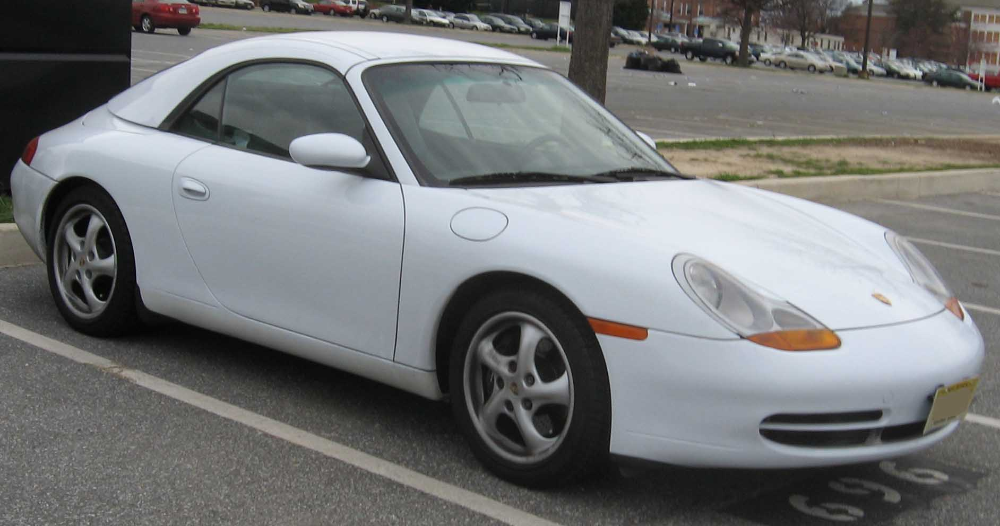
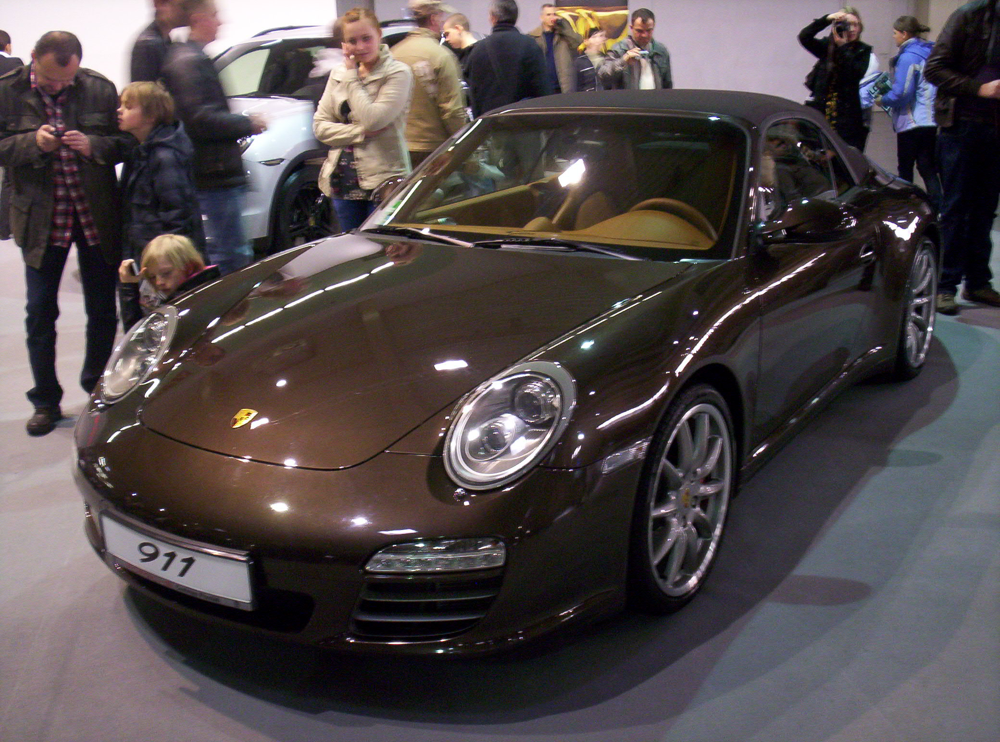
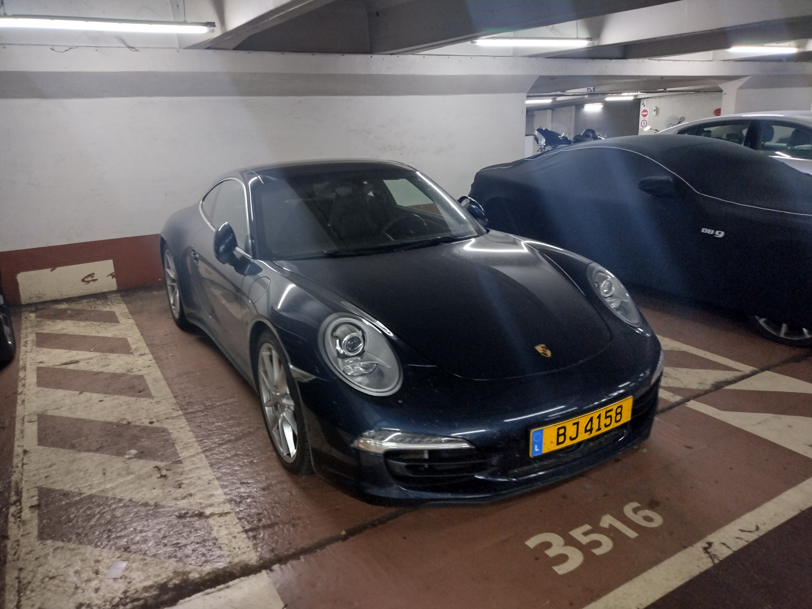

# Porsche 911 996–997–991 — универсальная шпаргалка

**Версия:** 1.0
**Срез рынка РФ:** 13 сентября 2026

> **Охват:** Porsche 911 поколений **996 (1997–2005)**, **997 (2004–2012)** и **991 (2011–2019)** — прежде всего машины, реально встречающиеся на вторичном рынке РФ.
>
> **Не входит:** 992 и более новые поколения; глубокая гоночная специфика Cup/R/RSR; коллекционные оценки редчайших спецсерий.
>
> **Цель:** по одному документу понять поколение, рестайлинг, двигатель, коробку, IMS/bore-scoring-профиль, типовые проблемы, обслуживание, жидкости, PPI и порядок цен на вторичном рынке РФ.
>
> **Важно:** конкретный код двигателя/коробки, допуск масла, заправочный объём и сервисная процедура зависят от VIN, модельного года и рынка. Перед покупкой расходников финально сверять VIN/PET/PIWIS/мануал.

---

## Оглавление

- [Какой 911 покупать — короткий ответ](#which-one)
- [Легенда рисков и стоимости](#legend)
- [996 — 1997–2005](#gen-996)
- [Рынок РФ: 996](#market-996)
- [997 — 2004–2012](#gen-997)
- [Рынок РФ: 997](#market-997)
- [991 — 2011–2019](#gen-991)
- [Рынок РФ: 991](#market-991)
- [IMS, задиры и семейства моторов — самое важное](#engine-risks)
- [Коробки и привод](#transmissions)
- [Общие болезни кузова, охлаждения и электрики](#common)
- [Регламент обслуживания](#maintenance)
- [Масла ДВС: допуски и объёмы](#engine-oil)
- [Остальные жидкости](#fluids)
- [Топливо](#fuel)
- [PPI перед покупкой](#ppi)
- [Короткий полевой PPI](#field-ppi)
- [Шкала стоимости ремонтов](#repair-costs)
- [Короткая карта всей линейки](#quick-map)
- [Источники и подход к данным](#sources)
- [REFERENCES.md](REFERENCES.md)
- [CHANGELOG.md](CHANGELOG.md)
- [TL;DR](#tldr)

---

# Какой 911 покупать — короткий ответ

Если нужен **самый рациональный старый водяной 911**, первым кандидатом выглядит **997.2 Carrera / Carrera S**: уже **9A1/MA1 с DFI**, без старой конструкции M96/M97 с герметичным подшипником IMS, с PDK вместо Tiptronic и с заметно более спокойным профилем по классическим задирам.

Если нужен **911 подешевле и максимально аналоговый**, 996 — не плохой автомобиль сам по себе, но покупать его нужно не по цене, а по фактическому состоянию двигателя. Для Carrera M96 обязательны история IMS и грамотная эндоскопия. Хороший экземпляр лучше дешёвого в разы.

Если хочется **современного ежедневного 911**, 991.1 Carrera/S — очень удачная точка: атмосферный 9A1, хороший PDK, современный салон и ещё классическая атмосферная реакция. 991.2 быстрее и эффективнее, но Carrera уже переходит на 3.0 biturbo и добавляет турбосистему в список дорогих узлов.

Если хочется **Turbo/GT**, правило другое: шильдик уже вторичен. Важнее происхождение, аварии, трек, перегревы, over-rev, PCCB, central-lock, состояние турбин/охлаждения, история моторных работ и качество тюнинга.

### Практический рейтинг

| Задача | Версия | Почему |
|---|---|---|
| 🟢 Самый рациональный «классический» | **997.2 Carrera / S** | 9A1/DFI, PDK, нет старого IMS-профиля |
| 🟢 Современный атмосферный daily | **991.1 Carrera / S** | 350/400 л.с., 9A1, хороший баланс |
| 🟢 Дешевле войти в 911 | **996 Carrera** | самая доступная точка входа, но только после серьёзного PPI |
| 🟡 Эмоциональный sweet spot | **997.2 GTS / 991.1 GTS** | редкие, дорогие, но очень цельные версии |
| 🟡 Быстрый daily | **991.2 Carrera S / GTS** | 3.0 biturbo, высокая отдача, современность |
| 🟠 Старый Turbo | **996 Turbo / 997 Turbo** | моторная база сильная, но возраст и дорогая периферия |
| 🔴 GT/RS как «выгодная покупка» | **GT3/GT2/RS** | покупать только как отдельный проект с экспертным PPI |

---

# Легенда рисков и стоимости

### Риск двигателя

- 🟢 — нет характерного катастрофического дефекта семейства, но возрастные поломки возможны;
- 🟡 — есть дорогие известные слабые места, требующие проверки;
- 🟠 — эндоскопия/специализированный PPI обязательны;
- 🔴 — дорогая редкая версия, где ошибочная покупка может стоить миллионы.

### Условная стоимость владения

- 🟢 — относительно простой для Porsche сценарий;
- 🟡 — нормальный 911-бюджет, нужен резерв;
- 🟠 — дорогие агрегаты/шасси/редкая специфика;
- 🔴 — Turbo/GT/RS/PCCB/редкие детали и потенциально очень дорогой ремонт.

---

# 996 — 1997–2005

Первый серийный 911 с водяным охлаждением и первое поколение, где покупатель обычной Carrera сталкивается с тем самым набором **M96 + IMS + возможный bore scoring**. При этом Turbo/GT2/GT3 имеют другую, motorsport-derived архитектуру двигателя, обычно объединяемую под бытовым названием **Mezger**.

## Основные версии 996

| Версия | Двигатель | Код / семейство | Мощность | Привод | Коробка | Моторный риск | 💸 |
|---|---|---|---:|---|---|---|---|
| Carrera / Carrera 4 ранние | 3.4 NA | **M96.01 / M96.04 family** | 300 л.с. | RWD/AWD | 6MT / Tiptronic | 🟠 IMS + M96-проблемы | 🟡/🟠 |
| Carrera / Carrera 4 996.2 | 3.6 NA | **M96.03** | 320 л.с. | RWD/AWD | 6MT / Tiptronic | 🟠 IMS + повышенное внимание к цилиндрам | 🟠 |
| Carrera 4S | 3.6 NA | **M96.03** | 320 л.с. | AWD | 6MT / Tiptronic | 🟠 | 🟠 |
| 40 Jahre | 3.6 NA | **M96.03S / X51 family** | 345 л.с. | RWD | 6MT | 🟠 | 🟠 |
| Turbo | 3.6 TT | **M96.70 / Mezger-derived** | 420 л.с. | AWD | 6MT / Tiptronic | 🟡 другой профиль, без Carrera-style IMS | 🔴 |
| Turbo X50 / Turbo S | 3.6 TT | **M96.70 family** | 450 л.с. | AWD | 6MT / Tiptronic | 🟡 | 🔴 |
| GT3 | 3.6 NA | **M96.76 / M96.79** | 360 / 381 л.с. | RWD | 6MT | 🟡 motorsport engine | 🔴 |
| GT3 RS | 3.6 NA | **GT3/Mezger family** | 381 л.с. | RWD | 6MT | 🟡 | 🔴 |
| GT2 | 3.6 TT | **M96.70S family** | 462–483 л.с. | RWD | 6MT | 🟡 | 🔴 |

> Для редких GT/Turbo код и заводскую мощность конкретной машины проверять по VIN: существуют рынковые и модельно-годовые различия, X50 и поздние версии.

## 996 Carrera 3.4 — 300 л.с.

Это не «безопасный M96», а просто **менее склонный к классическому bore scoring, чем 3.6/3.8**, по накопленной практике профильных мотористов. IMS, RMS, AOS, помпа, расширительный бачок, цепные механизмы и возрастная система охлаждения никуда не исчезают.

### Что проверять

- документированную историю IMS, если подшипник обслуживаемого типа;
- масляный фильтр на металл/пластик;
- эндоскоп цилиндров, особенно если есть расход масла, тик, дым или неодинаковые свечи;
- AOS и вакуум;
- помпу, радиаторы, расширительный бачок;
- катушки и свечи;
- течи RMS — отдельно от самого IMS;
- стабильность давления масла и температуры.

## 996.2 Carrera / C4 / C4S 3.6 — 320 л.с.

Более тяговитый и приятный мотор, но **M96.03 — версия, где эндоскоп уже нельзя считать факультативным**. На старой машине хорошая косметика вообще ничего не говорит о поверхности цилиндров.

### Вердикт

> Купить можно и нужно, если нравится 996, но только после **холодного старта + PIWIS/Durametric + фильтр + эндоскоп + понимание IMS**.

## IMS на 996 — что важно без мифологии

IMS — промежуточный вал привода ГРМ. Проблема ранних водяных Carrera связана не с самим фактом существования вала, а с конструкцией его **герметичного шарикового подшипника**.

Важно:

- конструкция менялась по годам;
- нельзя определять тип подшипника только по году регистрации;
- часть решений обслуживается при снятой коробке, часть требует иного подхода;
- «IMS поменян» без счёта, марки детали, пробега и даты — почти ничего не значит;
- перед любым retrofit мотор сначала должен пройти pre-qualification: нет смысла ставить дорогой IMS-kit в уже умирающий по цилиндрам двигатель.

## 996 Turbo / GT2 / GT3 — почему это отдельная история

У них другая архитектура двигателя, происходящая от гоночной линии GT1/Mezger. **Классический Carrera-style IMS bearing failure к ним не относится**, как и типичный профиль M96 Carrera по цилиндрам.

Но это не означает «вечный мотор»:

- Turbo — патрубки/фитинги охлаждения, турбины, вакуум/наддув, тепло;
- GT — over-rev, трек, масляная система, дорогая головка/низ;
- возрастные шланги, радиаторы, теплообменники и уплотнения;
- тюнинг и повышенный boost резко меняют экономику.

## Общие болезни 996

- передние радиаторы и конденсоры забиваются мусором и корродируют;
- расширительный бачок и помпа;
- AOS;
- катушки/свечи;
- RMS;
- механизмы стеклоподъёмников и замков;
- микрики замка зажигания;
- пиксели/дисплеи и возрастная электрика;
- дренажи кабриолета;
- гидравлика/механика крыши;
- рычаги, опоры, ступичные;
- коррозия крепежа/трубок у машин из плохого климата;
- последствия старых ДТП — важнее мелких косметических дефектов.

## Рейтинг 996

| Критерий | Оценка |
|---|---|
| Эмоции / аналоговость | ⭐⭐⭐⭐⭐ |
| Ежедневная практичность | ⭐⭐⭐ |
| Доступность входа | ⭐⭐⭐⭐ |
| Риск обычной Carrera без PPI | ⭐⭐ |
| Ремонтопригодность | ⭐⭐⭐ |
| Потенциал роста хорошего экземпляра | ⭐⭐⭐⭐ |

---

# Рынок РФ: 996 — сентябрь 2026

Рынок очень маленький. На Drom на дату среза было **9 активных объявлений**, то есть математическая медиана здесь легко врёт.

| Сегмент | Рабочий ориентир предложения | Комментарий |
|---|---:|---|
| Carrera/C4 с пробегом и вопросами | **≈2.5–3.3 млн ₽** | дешёвый вход почти всегда требует особенно жёсткого PPI |
| Carrera/C4 живее рынка | **≈3.3–4.2 млн ₽** | основная зона обычных машин |
| C4S / редкие хорошие MT | **≈4.0–6.0 млн ₽** | история и кузов решают больше года |
| Turbo | **≈5.5 млн ₽ и сильно выше** | выборка микроскопическая |
| GT3/GT2/RS | **не котировать общей таблицей** | коллекционный рынок, оценивать конкретную машину |

В живой выдаче встречались, например, Carrera 3.4 Tiptronic около 4.0 млн, Carrera 4/Carrera около 2.5–3.35 млн, C4S MT около 4.0 млн. Это **цены предложения**, не закрытых сделок.

---

# 997 — 2004–2012

997 визуально возвращает круглые фары, но технически главное разделение проходит не по внешности, а по **997.1 vs 997.2**.

> **997.1 Carrera/S = M96.05/M97.01: IMS-тема ещё существует в переходной форме + bore scoring.**
> **997.2 Carrera/S = 9A1/MA1 DFI: принципиально новая архитектура без старого IMS-подшипника.**

## Основные версии 997

| Версия | Двигатель | Код / семейство | Мощность | Привод | Коробка | Моторный риск | 💸 |
|---|---|---|---:|---|---|---|---|
| 997.1 Carrera / C4 | 3.6 NA | **M96.05** | 325 л.с. | RWD/AWD | 6MT / Tiptronic | 🟠 bore scoring + переходный IMS | 🟠 |
| 997.1 Carrera S / 4S / Targa 4S | 3.8 NA | **M97.01** | 355 л.с. | RWD/AWD | 6MT / Tiptronic | 🟠 **один из главных кандидатов на эндоскоп** | 🟠 |
| 997.1 S X51 | 3.8 NA | **M97.01S family** | 381 л.с. | RWD/AWD | 6MT / Tiptronic | 🟠 | 🔴 |
| 997.1 Turbo | 3.6 TT | **M97.70 / Mezger-derived** | 480 л.с. | AWD | 6MT / Tiptronic | 🟡 отдельный профиль | 🔴 |
| 997.1 GT3 / RS | 3.6 NA | **M97.76 family** | 415 л.с. | RWD | 6MT | 🟡 | 🔴 |
| 997.1 GT2 | 3.6 TT | **M97.70S family** | 530 л.с. | RWD | 6MT | 🟡 | 🔴 |
| 997.2 Carrera / C4 | 3.6 DFI | **MA1.02 / 9A1** | 345 л.с. | RWD/AWD | 6MT / 7PDK | 🟢/🟡 | 🟡/🟠 |
| 997.2 Carrera S / 4S / Targa 4S | 3.8 DFI | **MA1.01 / 9A1** | 385 л.с. | RWD/AWD | 6MT / 7PDK | 🟢/🟡 | 🟠 |
| 997.2 GTS | 3.8 DFI | **MA1.01S family** | 408 л.с. | RWD/AWD | 6MT / 7PDK | 🟢/🟡 | 🔴 |
| 997.2 Turbo | 3.8 DFI TT | **MA1.70** | 500 л.с. | AWD | 6MT / 7PDK | 🟡 | 🔴 |
| 997.2 Turbo S | 3.8 DFI TT | **MA1.70S family** | 530 л.с. | AWD | 7PDK | 🟡 | 🔴 |
| 997.2 GT3 / RS | 3.8 NA | **M97.77 family** | 435 / 450 л.с. | RWD | 6MT | 🟡 Mezger GT | 🔴 |
| GT3 RS 4.0 | 4.0 NA | **M97.74 family** | 500 л.с. | RWD | 6MT | 🟡 | 🔴 |
| GT2 RS | 3.6 TT | **M97.70R family** | 620 л.с. | RWD | 6MT | 🟡 | 🔴 |

## 997.1 Carrera 3.6 — M96.05

Последняя эволюция M96. IMS уже менялся по ходу производства: на самых ранних моторах может встречаться обслуживаемый вариант старого типа, позднее — увеличенный подшипник, который штатно не меняется без разборки мотора.

Но при покупке важнее не спорить на форуме о процентах IMS, а проверить **сам двигатель целиком**.

### PPI

- холодный старт;
- эндоскоп **всех цилиндров**;
- лучше смотреть со стороны картера/снизу, где характерные риски появляются раньше;
- масляный фильтр;
- коррекции/пропуски;
- расход масла;
- IMS/RMS documentation;
- AOS;
- помпа/термостат;
- состояние выхлопа и катализаторов.

## 997.1 Carrera S 3.8 — M97.01

Вот здесь экономить на эндоскопе особенно бессмысленно. Больший диаметр цилиндра делает **3.8 M97 одним из наиболее известных кандидатов на bore scoring** среди водяных Carrera этого периода.

Симптомы могут быть неидеальными и не обязаны присутствовать все сразу:

- тиканье на прогретом моторе;
- повышенный расход масла;
- более чёрная одна сторона выхлопа;
- масляный налёт;
- пропуски;
- вертикальные полосы на стенке цилиндра.

Отсутствие дыма не является гарантией.

## 997.2 Carrera / S — 9A1/MA1

Именно поэтому 997.2 настолько интересен как покупка.

Новый двигатель получил:

- DFI;
- новую архитектуру картера;
- отсутствие старой M96/M97 схемы IMS с проблемным шариковым подшипником;
- существенно иной профиль по цилиндрам.

Это **не означает абсолютной неубиваемости**. Проверяем:

- форсунки DFI;
- ТНВД;
- нагар;
- помпу/термостат;
- вакуум;
- утечки;
- масло/фильтр;
- ошибки фаз;
- перегревы и историю обслуживания.

Но покупать 997.2 только из страха перед M96/M97 — вполне рациональная логика.

## 997 Turbo/GT — отдельная ветка

997.1 Turbo/GT сохраняют motorsport/Mezger-derived архитектуру. На Turbo известен возрастной вопрос **вклеенных/запрессованных патрубков охлаждения**: на сильно нагруженных машинах важно понимать, делалась ли профилактика, не было ли выброса ОЖ и как именно ремонтировали фитинги.

997.2 Turbo уже переходит на 9A1 turbo architecture; GT3/RS при этом ещё остаются на Mezger-derived GT-моторах.

## Общие болезни 997

- радиаторы/конденсоры и мусор в воздуховодах;
- помпа/термостат;
- AOS у ранних атмосферников;
- генераторный/стартерный силовой кабель и медленный горячий старт на части машин;
- катушки/свечи;
- PASM-стойки и опоры;
- рычаги/сайлентблоки/ступичные;
- заслонки/механизмы выхлопа;
- механизмы Cabriolet/Targa;
- дренажи;
- PCM и возрастная мультимедиа;
- PCCB — оценивать диск, а не только остаток колодки;
- central-lock на соответствующих версиях — правильный инструмент/момент/процедура.

## Рейтинг 997

| Критерий | 997.1 | 997.2 |
|---|---:|---:|
| Внешность/классический 911 | ⭐⭐⭐⭐⭐ | ⭐⭐⭐⭐⭐ |
| Риск двигателя Carrera | ⭐⭐ | ⭐⭐⭐⭐ |
| Коробка auto | Tiptronic ⭐⭐⭐ | PDK ⭐⭐⭐⭐⭐ |
| Аналоговость | ⭐⭐⭐⭐⭐ | ⭐⭐⭐⭐ |
| Daily | ⭐⭐⭐⭐ | ⭐⭐⭐⭐⭐ |
| Цена хорошего экземпляра | ⭐⭐⭐⭐ | ⭐⭐⭐ |

---

# Рынок РФ: 997 — сентябрь 2026

На Drom на дату среза было около **15 активных 997**, то есть разброс конкретных машин огромен.

| Сегмент | Рабочий ориентир предложения | Комментарий |
|---|---:|---|
| 997.1 Carrera/S с большим пробегом | **≈4.2–5.0 млн ₽** | эндоскоп и история важнее «дёшево» |
| 997.1 хороший Carrera/S/4S | **≈5.0–6.5 млн ₽** | редкие чистые машины могут быть выше |
| 997.2 Carrera/S/4S | **≈4.6–7.0 млн ₽** | выборка маленькая, состояние сильно двигает цену |
| 997.2 GTS | **≈8 млн ₽+** | редкость |
| 997 Turbo | **≈7–15 млн ₽**, выбросы выше | пробег/MT/история создают огромный разброс |
| GT3/GT2/RS | **индивидуальная оценка** | общий диапазон бессмысленен |

На живом рынке встречались 997.2 Carrera 4S PDK около 4.6 млн, Carrera 4 PDK 6.0–6.4 млн, 997.1 Carrera S 4.2–5.5 млн, Turbo от ~7–8.5 млн до коллекционных двузначных цен.

---

# 991 — 2011–2019

991 заметно крупнее и современнее 997, получает электромеханический усилитель, более длинную базу, широкое применение PDK и очень развитое шасси. Главный водораздел:

> **991.1 Carrera = атмосферные 3.4/3.8.**
> **991.2 Carrera = 3.0 biturbo.**

## Основные версии 991

| Версия | Двигатель | Код / семейство | Мощность | Привод | Коробка | Моторный риск | 💸 |
|---|---|---|---:|---|---|---|---|
| 991.1 Carrera / C4 | 3.4 DFI NA | **MA1.04 / 9A1** | 350 л.с. | RWD/AWD | 7MT / 7PDK | 🟢/🟡 | 🟡 |
| 991.1 Carrera S / 4S | 3.8 DFI NA | **MA1.03 / 9A1** | 400 л.с. | RWD/AWD | 7MT / 7PDK | 🟢/🟡 | 🟡/🟠 |
| 991.1 GTS | 3.8 DFI NA | **9A1/MA1 3.8 GTS family** | 430 л.с. | RWD/AWD | 7MT / 7PDK | 🟢/🟡 | 🟠 |
| 991.1 Turbo | 3.8 TT | **MA1.71 family** | 520 л.с. | AWD | 7PDK | 🟡 | 🔴 |
| 991.1 Turbo S | 3.8 TT | **MA1.71 family** | 560 л.с. | AWD | 7PDK | 🟡 | 🔴 |
| 991.1 GT3 | 3.8 NA | **MA1.75 family** | 475 л.с. | RWD | 7PDK | 🟠 campaign/history critical | 🔴 |
| 991.1 GT3 RS / 911 R | 4.0 NA | **MA1.76 family** | 500 л.с. | RWD | PDK / 6MT (R) | 🟡/🟠 | 🔴 |
| 991.2 Carrera / C4 / T | 3.0 TT | **MDC.KA** | 370 л.с. | RWD/AWD | 7MT / 7PDK | 🟡 | 🟡/🟠 |
| 991.2 Carrera S / 4S | 3.0 TT | **MDC.HA** | 420 л.с. | RWD/AWD | 7MT / 7PDK | 🟡 | 🟠 |
| 991.2 GTS | 3.0 TT | **MDC.JA** | 450 л.с. | RWD/AWD | 7MT / 7PDK | 🟡 | 🟠/🔴 |
| 991.2 Turbo | 3.8 TT | **MDA.BA family** | 540 л.с. | AWD | 7PDK | 🟡 | 🔴 |
| 991.2 Turbo S | 3.8 TT | **MDB.CA family** | 580 л.с. | AWD | 7PDK | 🟡 | 🔴 |
| 991.2 GT3 | 4.0 NA | **GT 4.0 / MDG family** | 500 л.с. | RWD | 6MT / 7PDK | 🟡 | 🔴 |
| 991.2 GT3 RS | 4.0 NA | **GT 4.0 family** | 520 л.с. | RWD | 7PDK | 🟡 | 🔴 |
| 991.2 GT2 RS | 3.8 TT | **MDH.NA family** | 700 л.с. | RWD | 7PDK | 🔴 | 🔴 |
| Speedster | 4.0 NA | **GT 4.0 family** | 510 л.с. | RWD | 6MT | 🔴 редкость | 🔴 |

## 991.1 Carrera 3.4 / S 3.8

Для человека, который хочет атмосферный 911 без M96/M97-эпопеи, это одна из лучших зон.

Проверяем:

- холодный запуск и фазовращатели;
- DFI/форсунки;
- топливное давление;
- помпу/термостат;
- масло и фильтр;
- коррекции/пропуски;
- катушки/свечи;
- активные опоры двигателя, если есть Sport Chrono;
- PDK и историю масла;
- состояние выпускных заслонок;
- радиаторы и конденсоры.

**Bore scoring не объявляем невозможным**, но это уже не тот профиль риска, что у M96/M97 3.6/3.8.

## 991.2 Carrera 3.0 biturbo

Carrera становится турбированной: 370 / 420 / 450 л.с.

К плюсам относятся огромный запас тяги и потенциал, к минусам — больше дорогой периферии:

- турбины и актуаторы;
- charge-air tract;
- утечки воздуха;
- wastegate;
- тепло;
- охлаждение;
- вакуум;
- повышенная нагрузка после тюнинга.

Покупать чипованную машину можно только понимая **кто, чем, когда и на каком топливе** её настраивал.

## 2014 991 GT3 — обязательная проверка кампании AE01

Это не форумная страшилка. Porsche официально проводил **отзывную кампанию с заменой двигателя** на затронутых 911 GT3 MY2014 после случаев ослабления болта шатуна и повреждения картера.

Поэтому для раннего 991 GT3:

- проверить VIN по кампании;
- номер установленного двигателя;
- документы замены;
- последующую историю обслуживания;
- over-rev/эксплуатацию;
- масло и фильтр.

Фраза продавца «там всё давно сделали» без документов недостаточна.

## 991: дорогое шасси, которое тоже надо проверять

- PASM;
- PDCC;
- rear-axle steering на соответствующих версиях;
- dynamic engine mounts;
- front axle lift;
- central-lock;
- PCCB;
- активная аэродинамика Turbo/GT;
- передние радиаторы/конденсоры;
- геометрия после ДТП.

## Targa 991

Красивый и технически сложный механизм крыши. Проверка должна быть полной:

- открытие/закрытие несколько циклов;
- датчики положения;
- посторонние звуки;
- герметичность;
- дренажи;
- следы регулировки/ремонта;
- вода в салоне/багажных нишах.

## Рейтинг 991

| Критерий | 991.1 | 991.2 |
|---|---:|---:|
| Атмосферные эмоции | ⭐⭐⭐⭐⭐ | ⭐⭐⭐ |
| Тяга/скорость Carrera | ⭐⭐⭐⭐ | ⭐⭐⭐⭐⭐ |
| Daily | ⭐⭐⭐⭐⭐ | ⭐⭐⭐⭐⭐ |
| Простота силовой части | ⭐⭐⭐⭐ | ⭐⭐⭐ |
| Электроника/сложность шасси | ⭐⭐⭐ | ⭐⭐⭐ |
| Цена входа | ⭐⭐⭐ | ⭐⭐ |

---

# Рынок РФ: 991 — сентябрь 2026

На Drom на дату среза было около **26 активных 991**, из них около 10 дорестайлинговых и 16 рестайлинговых. Это уже лучше 996/997, но редкие версии всё равно нельзя оценивать как биржевой товар.

| Сегмент | Рабочий ориентир предложения | Комментарий |
|---|---:|---|
| 991.1 Carrera/S/4S | **≈6.8–9.0 млн ₽** | пробег и кузов создают большую разницу |
| 991.1 редкие/очень малый пробег | **≈9–14 млн ₽** | спецификация важнее среднего рынка |
| 991.1 GT3 | **≈10.7 млн ₽+** | обязательно AE01/engine lineage |
| 991.2 Carrera/S/4S | **≈8.8–12.5 млн ₽** | основная современная зона |
| 991.2 Turbo/Turbo S | **≈14–15 млн ₽+** | выборка маленькая |
| 991.2 GT2 RS | **≈25 млн ₽+** | уже коллекционный/редкий рынок |
| GT3/RS/Speedster | **индивидуальная оценка** | состояние, опции, история и происхождение решают всё |

Живые примеры на дату среза: 991.1 Carrera 4S около 6.8–7.9 млн, Carrera S 7.5–7.7 млн; 991.2 Carrera 4/4S около 8.8–10.5 млн; Turbo S около 14.5 млн; GT2 RS около 25 млн.

---

# IMS, задиры и семейства моторов — самое важное

Эта таблица — главная причина существования справочника.

| Семейство | Где | IMS старого типа | Классический bore-scoring профиль | Что делать перед покупкой |
|---|---|---|---|---|
| **M96 Carrera** | 996 Carrera | **Да, конструкция зависит от года** | 🟠 есть | история IMS + эндоскоп + фильтр |
| **M96.05 / M97 Carrera** | 997.1 | **переходная/увеличенная конструкция** | 🟠 особенно 3.8 | эндоскоп обязателен |
| **Mezger-derived Turbo/GT** | 996 Turbo/GT, 997.1 Turbo/GT, 997.2 GT | **нет Carrera-style failure mode** | не типичный M96 Carrera risk | специализированный Turbo/GT PPI |
| **9A1/MA1 NA** | 997.2, 991.1 Carrera | **нет старой схемы** | существенно ниже | обычный глубокий PPI, фильтр при сомнениях |
| **9A1/MA1 turbo** | 997.2 Turbo, 991 Turbo | **нет старой схемы** | не главный риск | турбины/наддув/охлаждение/PDK |
| **991.2 3.0TT** | Carrera/S/GTS | **нет** | не главный риск | турбины/heat management/boost leaks |

### Не путать три вещи

**IMS**, **RMS** и **bore scoring** — три разных проблемы.

- IMS — подшипник/узел промежуточного вала;
- RMS — задний сальник коленвала, сам по себе обычно не означает смерть двигателя;
- bore scoring — повреждение рабочей поверхности цилиндра, потенциально требующее дорогого ремонта блока.

Замена RMS не «лечит IMS». Замена IMS не «лечит задиры». Сухой мотор снаружи не гарантирует целые цилиндры.

---

# Коробки и привод

## 996

- 6-ступенчатая механика;
- 5-ступенчатый Tiptronic на автоматических версиях;
- RWD или AWD в зависимости от версии.

Проверять механику:

- синхронизаторы;
- особенно 2-ю передачу на проблемных экземплярах;
- сцепление;
- двухмассовый маховик;
- течи;
- тросы/кулису.

Tiptronic обычно прочный, но возраст уже огромный: масло, гидроблок, блокировка ГТ, пинки и задержки D/R важнее мифа «масло на весь срок».

## 997.1

Та же общая философия: 6MT или Tiptronic.

## 997.2

Ключевой переход — **7PDK**. Это первая серийная эпоха PDK на 911.

Проверять:

- D/R без длинной паузы;
- плавное трогание;
- отсутствие judder;
- переключения на холодную и горячую;
- kickdown;
- ручной режим;
- ошибки;
- температуры;
- adaptation values;
- историю масла/фильтра.

## 991

Основные коробки:

- 7PDK;
- 7MT на Carrera/GTS;
- 6MT на некоторых поздних GT-версиях (например 991.2 GT3, 911 R/Speedster в своей спецификации).

PDK хороша, но не бесплатна. Мехатроник, сцепления и крупный внутренний ремонт могут стоить сотни тысяч рублей.

## AWD

Полный привод не делает 911 внедорожником. Проверять:

- одинаковый размер/модель шин на оси и правильную общую комбинацию;
- близкий износ;
- отсутствие ошибок PSM/PTM;
- передний редуктор/привода;
- вибрации под тягой;
- историю жидкостей там, где они обслуживаются.

---

# Общие болезни кузова, охлаждения и электрики

## Передняя часть

У всех этих 911 радиаторы и конденсоры находятся в очень уязвимой зоне воздухозаборников.

Проверить:

- листья/грязь между пакетами;
- коррозию;
- течи ОЖ;
- утечки хладагента;
- вентиляторы;
- следы ремонта после удара;
- состояние пластиковых воздуховодов.

## Вода

- дренажи люка/кабриолета/Targa;
- мокрые ковры;
- вода под сиденьями;
- разъёмы и блоки;
- запах сырости;
- запотевание.

## Подвеска

На машине 15–25-летнего возраста даже «Porsche с маленьким пробегом» может иметь мёртвые резиновые элементы.

Проверять:

- рычаги;
- сайлентблоки;
- шаровые;
- опоры;
- ступичные;
- PASM;
- высоту кузова;
- следы дешёвых нештатных решений.

## Тормоза

Обычные стальные тормоза дороги, но предсказуемы.

**PCCB** требуют отдельной оценки:

- сколы;
- поверхность;
- перегрев;
- реальный износ;
- история замены;
- стоимость нового комплекта.

«Керамика есть» — не всегда плюс к цене, если диски на исходе.

---

# Регламент обслуживания

Ниже два слоя: **заводской принцип** и **практический интервал для возрастной машины**. Практический интервал намеренно консервативнее длинных заводских интервалов.

| Работа | Практический ориентир |
|---|---|
| Масло ДВС + фильтр | **раз в год или 7.5–10 тыс. км**; GT/трек/короткие поездки — чаще |
| Воздушные фильтры | 20–30 тыс. км, чаще в пыли |
| Салонный фильтр | ежегодно |
| Свечи | обычно 40–60 тыс. км; Turbo/GT — сверять модельный регламент, часто чаще |
| Катушки | по состоянию, менять деградирующие комплектно/осмысленно |
| Тормозная жидкость | **каждые 2 года** |
| Ремень навесного | осмотр каждое ТО; возраст важен не меньше пробега |
| ОЖ | состояние/спецификация/герметичность; неизвестную историю лучше привести к понятному состоянию |
| PDK | практично ориентироваться примерно на 60 тыс. км, но точный регламент зависит от поколения/года |
| Tiptronic | не считать «вечным»; обслуживание по состоянию/истории, часто 60–80 тыс. км |
| Механика/редукторы | 60–100 тыс. км как разумный возрастной ориентир, VIN/мануал приоритетнее |

### Для мало ездящей машины

Пять тысяч километров за пять лет — **не аргумент не менять жидкости**. Возраст влияет на тормозную жидкость, топливо, резину, ремни, уплотнения, аккумулятор и коррозию.

---

# Масла ДВС: допуски и объёмы

Для основной массы 996/997/991 до MY2020 ключевой исторический допуск — **Porsche A40**. Но у поздних 991, особенно с бензиновым сажевым фильтром и у части GT-моделей, могут применяться другие Porsche approvals (включая C40/C40 GT в соответствующих бюллетенях).

> **Не выбирать масло только по вязкости.** Сначала нужный Porsche approval для конкретного VIN/model year, потом конкретный продукт из действующего approval list.

Официальный список Porsche A40 02/26 прямо охватывает автомобили до MY2020, для которых A40 назначен. Для конкретной поздней машины всё равно сверять allocation bulletin.

### Рабочие сервисные объёмы

| Версия | Ориентир при сервисе | Комментарий |
|---|---:|---|
| 996 Carrera 3.4 | **≈8.25 л** | с фильтром; проверять по уровню/процедуре |
| 996 Carrera 3.6 | **≈8.25 л** | с фильтром |
| 996 GT3 | **≈8.5–9.0 л** | зависит от MY |
| 997.1 Carrera 3.6 | **≈8.25 л** | M96.05 |
| 997.1 Carrera S 3.8 | **≈8.5 л** | M97.01 |
| 997.2 Carrera/S/GTS | **≈7.5 л** | 9A1/MA1 |
| 997.2 Turbo/S | **≈7.5 л** | рабочий ориентир |
| 997.2 GT3/RS | **≈9.0 л** | GT dry-sump architecture; процедура критична |
| 991.1 Carrera/S/GTS | **≈7.5 л** | 9A1 |
| 991.1 Turbo/S | **≈7.5 л** | |
| 991.2 Carrera/S/GTS 3.0TT | **≈8.0 л** | |
| 991.2 Turbo/S | **≈7.5 л** | |
| 991.2 GT3/RS | **≈6.4 л** | сверять конкретную GT-версию |
| 991.2 GT2 RS | **≈7.5 л** | |

Это **не инструкция «залить сразу столько»**. Уровень выставляется по штатной процедуре с нужной температурой/режимом, а точный объём зависит от того, насколько система была слита.

---

# Остальные жидкости

## Тормозная жидкость

**DOT 4 требуемого Porsche класса**, каждые 2 года. Для трека — жидкость с подходящими температурными характеристиками и более частая замена.

## Охлаждающая жидкость

Не выбирать по цвету.

- точная Porsche specification по поколению/VIN;
- неизвестную смесь лучше не «доливать чем-то похожим» бесконечно;
- после крупного ремонта важно правильное вакуумное заполнение/развоздушивание.

## PDK / Tiptronic / механика

Нельзя переносить жидкость между коробками по принципу «это же Porsche 911».

- PDK имеет собственную спецификацию и процедуру уровня;
- Tiptronic — другую;
- механическая коробка — свою;
- передний/задний редукторы — свои.

**VIN и индекс коробки — перед заказом масла.**

---

# Топливо

| Топливо | Вердикт |
|---|---|
| **АИ-92** | ❌ не использовать как штатное |
| **АИ-95** | 🟡 возможен как допустимый минимум на части версий, но не базовый выбор для высокофорсированного 911 |
| **АИ-98** | 🟢 основной разумный выбор для большинства 996/997/991 |
| **АИ-100** | 🟢 допустим; особенно логичен для Turbo/GT/тюнинга при соответствующей калибровке |

Если машина прошита, требуемое октановое число определяет **конкретная прошивка**, а не заводская табличка двадцатилетней давности.

---

# PPI перед покупкой

## 1. Документы и происхождение

- VIN;
- ПТС/ЭПТС;
- регистрационная история;
- ДТП;
- ограничения/залоги;
- пробеги;
- заказ-наряды;
- Porsche/PIWIS history;
- номера двигателя/коробки на редких версиях;
- заводская комплектация;
- крупные моторные работы;
- тюнинг/прошивки;
- трековая эксплуатация.

Для GT/RS/Turbo происхождение может менять цену на миллионы.

## 2. Только холодный старт

Продавец не должен заранее прогревать машину.

Слушаем:

- цепи;
- тяжёлый ритмичный тик;
- пропуски;
- гидрики/фазы;
- дым;
- турбины;
- посторонние звуки навесного.

## 3. PIWIS / Durametric

Минимум:

- DME;
- коробка;
- PSM/ABS;
- PASM;
- AWD/PTM на соответствующих версиях;
- rear axle steering/PDCC/engine mounts на 991;
- климат;
- кузовные блоки;
- PCM;
- постоянные/intermittent/stored faults.

### Over-rev

На механических машинах — особенно GT — считать over-rev ranges обязательной частью PPI. Важны **диапазон, число воспламенений и часы работы после события**, а не только факт наличия записи.

## 4. Эндоскоп

### 996 Carrera и 997.1 Carrera/S

**Обязателен.** Смотреть все цилиндры, а не один «для галочки».

Ищем:

- вертикальные задиры;
- локальную потерю поверхности;
- зеркальность;
- масло;
- повреждения юбки поршня;
- неодинаковый нагар.

По M96/M97 полезен осмотр с той стороны цилиндра, где scoring обычно начинается; профильные специалисты часто используют доступ снизу через картер для более информативного угла.

### 997.2 / 991

Не надо автоматически ставить диагноз M96/M97. Эндоскоп всё равно разумен при:

- расходе масла;
- тике;
- пропусках;
- металле в фильтре;
- подозрительном ремонте;
- дорогой покупке GT/Turbo.

## 5. Масло и фильтр

Если цена автомобиля оправдывает глубокий PPI:

- вскрыть фильтр;
- искать металл/пластик;
- при сомнениях лабораторный анализ;
- проверить давление масла/температуры по диагностике.

## 6. Коробка

Холодная и горячая:

- D/R;
- трогание;
- все передачи;
- kickdown;
- ручной режим;
- отсутствие slip/flare;
- адаптации;
- ошибки;
- история обслуживания.

Для MT — сцепление, маховик, синхронизаторы, over-rev.

## 7. Охлаждение

- передние радиаторы;
- конденсоры;
- помпа;
- термостат;
- бачок;
- крышка;
- шланги;
- вентиляторы;
- стабильность температуры;
- Turbo/GT — фитинги/магистрали и следы старых ремонтов.

## 8. Подвеска и активные системы

- PASM;
- PDCC;
- RWS;
- active engine mounts;
- front lift;
- ступичные;
- рычаги;
- геометрия;
- высота кузова.

## 9. Тормоза и колёса

- диски/колодки;
- PCCB;
- central lock;
- трещины/ремонт дисков;
- возраст шин;
- N-mark не является магией, но правильный размер/load/speed и одинаковая логичная резина критичны;
- на AWD особенно важна согласованность окружности колёс.

## 10. Кузов

- толщиномер;
- лонжероны/силовые зоны;
- крепления подвески;
- передний/задний модуль;
- днище;
- швы;
- фары;
- геометрия зазоров;
- следы трека/бордюров снизу.

---

# Короткий полевой PPI — открыть на телефоне

- [ ] VIN / история / ограничения / ДТП
- [ ] машина реально холодная
- [ ] нет тяжёлого тика/дыма/пропусков
- [ ] PIWIS/Durametric всех ключевых блоков
- [ ] MT: over-rev ranges + сцепление/маховик
- [ ] 996 Carrera: IMS documentation + эндоскоп
- [ ] 997.1 Carrera/S: эндоскоп всех цилиндров
- [ ] масляный фильтр на металл при дорогой покупке/сомнениях
- [ ] Turbo/GT: отдельная проверка охлаждения, турбин, истории трека/тюнинга
- [ ] 2014 991 GT3: AE01 / номер двигателя / документы замены
- [ ] PDK/Tiptronic холодная и горячая
- [ ] радиаторы/конденсоры/помпа/термостат
- [ ] PASM/PDCC/RWS/опоры/lift если стоят
- [ ] PCCB и central-lock если стоят
- [ ] одинаковая логичная резина и правильные размеры
- [ ] Cabrio/Targa: крыша + дренажи + вода
- [ ] кузов толщиномером и снизу
- [ ] после диагностики остаётся финансовый резерв

---

# Шкала стоимости ремонтов — грубо, РФ 2026

Это **не прайс-лист сервиса**, а порядок величины для решения о покупке. На GT/Turbo/редких деталях разброс особенно велик.

| Работа | Очень грубый порядок |
|---|---:|
| Большое ТО с жидкостями/свечами/фильтрами | **≈80–180 тыс. ₽** |
| Помпа/термостат/охлаждение | **≈80–200 тыс. ₽** |
| Подвеска по кругу без экзотики | **≈150–400 тыс. ₽** |
| Тормоза стальные по кругу | **≈200–500 тыс. ₽** |
| PDK мехатроник/средний ремонт | **≈150–350 тыс. ₽+** |
| PDK крупный ремонт | **≈300–700 тыс. ₽+** |
| IMS job на обслуживаемом M96 при снятии коробки | **≈150–300 тыс. ₽+**, зависит от решения и сопутствующих работ |
| Полноценный ремонт M96/M97 из-за цилиндров | **≈700 тыс.–1.5 млн ₽+** |
| Турбины/наддув/крупная периферия Turbo | **сотни тысяч ₽**, легко выше |
| PCCB | **может перейти за 1 млн ₽** в зависимости от оси/деталей |
| GT/Turbo двигатель | **миллионы ₽ возможны** |

Цена дешёвого 996/997 может отличаться от цены хорошего всего на 1–2 млн, а плохой двигатель способен съесть значительную часть этой разницы.

---

# Короткая карта всей линейки

## 996

**Carrera 3.4 300** → самый доступный → IMS/M96 → 3.4 не «иммунен», но профиль scoring мягче 3.6/3.8.
**Carrera 3.6 320 / C4S** → красивее/тяговитее → эндоскоп обязателен.
**Turbo 420–450** → Mezger-derived → нет Carrera-style IMS → дорогая периферия.
**GT3/GT2** → отдельный экспертный рынок.

## 997

**997.1 Carrera 325** → M96.05 → переходный IMS + эндоскоп.
**997.1 S/4S 355** → M97.01 → один из главных кандидатов на bore-scoring PPI.
**997.2 Carrera 345 / S 385** → **9A1/DFI, sweet spot**.
**GTS 408** → очень желанная редкая 997.2.
**Turbo/GT** → отдельная архитектура и отдельная экономика.

## 991

**991.1 Carrera 350** → атмосферный 3.4 → рационально.
**991.1 S 400 / GTS 430** → атмосферная вершина Carrera.
**991.2 Carrera 370 / S 420 / GTS 450** → 3.0 biturbo.
**Turbo 520–580** → очень быстро и дорого.
**GT3/RS/GT2 RS** → обязательна история, кампании, over-rev/track context.

### Мнемоника эволюции

> **996 Carrera: M96 + IMS/bore scoring → 997.1: последняя эволюция M96/M97 → 997.2: 9A1/DFI → 991.1: атмосферный 9A1 → 991.2 Carrera: 3.0 biturbo.**

---

# Источники и подход к данным

Полный список: [`REFERENCES.md`](REFERENCES.md).

Приоритет:

1. официальные Porsche Newsroom / technical / recall / oil-approval документы;
2. Porsche Classic / каталоги двигателей и комплектаций;
3. профильные технические материалы по M96/M97/9A1;
4. LN Engineering / FCP Euro и другие профильные технические источники;
5. сообщества — только как источник повторяющихся практических кейсов, не как заводская истина;
6. Drom/Auto.ru — для моментального среза рынка РФ.

## Методика рынка

1. берутся живые предложения РФ на крупных площадках;
2. очевидные дубли и снятые объявления не должны формировать основной диапазон;
3. битые проекты, неходовые машины и нерепрезентативные цены рассматриваются отдельно;
4. фиксируются поколение, версия, коробка, пробег и цена;
5. цены — **asking prices**, а не подтверждённые суммы сделок;
6. для Turbo/GT/RS выборка настолько мала, что состояние конкретной машины важнее «средней цены».

---

# TL;DR

Если хочется один ответ:

- **996 Carrera** — покупать только после понимания IMS и эндоскопа M96;
- **997.1 S/4S 3.8** — эндоскоп обязателен;
- **997.2 Carrera/S** — самый рациональный sweet spot между классикой и техническим спокойствием;
- **991.1 Carrera/S** — лучший вариант, если нужен более современный атмосферный 911;
- **991.2 Carrera/S/GTS** — быстрее и современнее, но уже с 3.0 biturbo;
- **Turbo/GT/RS** — не покупать по общему чек-листу Carrera: это отдельный PPI и отдельный бюджет.

Главное правило для всех трёх поколений:

> **покупается не шильдик и не пробег на приборке, а конкретный кузов + конкретный двигатель + документированная история + результат профильного PPI.**
